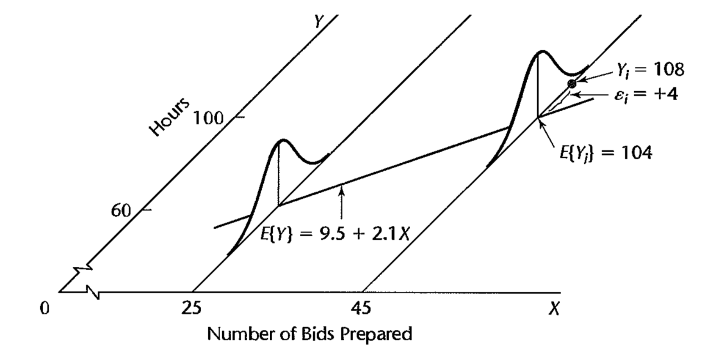

```{r setup, include=FALSE}
knitr::opts_chunk$set(echo = TRUE)
```

```{r, message=FALSE}
library(tidyverse)
library(latex2exp)
library(gridExtra)
library(wesanderson)
library(plotly)
```


### Problem 1: 
Refer to the sales volume example on page 3. Suppose that the number of units sold is measured accurately, bur clerical errors are frequently made in determining the dollar sales. Would the relation between the number of units sold and dollar sales still be a functional one? Discuss.

Answer: The relationship between the number of units sold and dollar sales would not be a functional one because there is no direct relationship due to the errors made.


### Problem 2: 
The members of a health spa pay annual membership dues of \$300 plus a charge of \$2 for each visit to the spa. Let $Y$ denote the dollar cost for the year for a member and $X$ the number of visits by the member during the year. Express the relation between $X$ and $Y$ mathematically. Is it a functional relation or a statistical relation?

Answer: The relationship between $X$ and $Y$ can be expressed as $$ Y = 2X + 300 $$ This is a functional relationship.

### Problem 3: 
Experience with a certain type of plastic indicates that a relation exists between the hardness (measured in Brinell units) of items molded from the plastic ($Y$) and the elapsed time since termination of the molding process ($X$). It is proposed to study this relation by means of regression analysis. A participant in the discussion objects, pointing out that the hardening of the plastic "is the result of a natural chemical process that doesn't leave anything to chance, so the relation must be mathematical and regression analysis is not appropriate." Evaluate this objection.

Answer: The relation would still be one that can be studied through a regression point of view. Whether the relationship is functional or statistical will be tested by measuring the hardness of plastic versus elapsed time since the termination of the molding process.

### Problem 4: 
In Table 1.1, the lot size $X$ is the same in production runs $1$ and $24$ but the work hours $Y$ differ. What feature of regression model (1.1) is illustrated by this?

Answer: The work hours $Y$ differ because of the random error term $\varepsilon$. 

### Problem 5: 
When asked to state the simple linear regression model, a student wrote it as follows: $E[Y_i] = \beta_0 + \beta_1X_i + \varepsilon$. Do you agree?

Answer: No. The expected value of the error term is zero and thus falls out of $E[Y_i]$ which is the expected value of a single observation.

### Problem 6: 
Consider the normal error regression model (1.24). Suppose that the parameter values are $\beta_0 = 200$, $\beta_1 = 5.0$ and $\sigma = 4$. 

(a) Plot the normal error regression model in the fashion of Figure 1.6. Show the distributions of $Y$ for $X=10,~20$, and $40$. 

Answer:
```{r}
seq_maker = function(y){return(seq(y - (4*3), y + (4*3), length.out = 200))}

data.frame(x = c(10, 20, 40)) %>%
  mutate(y = 200 + (5*x)) %>%
  ggplot(aes(x,y)) + geom_point(size = 0.75) + 
  geom_abline(intercept = 200, slope = 5, color = "cornflowerblue", 
                 linetype="dotted", size = 1) + 
  geom_path(data = data.frame(y = seq_maker(250),
                              x = 10 + 25*dnorm(seq_maker(250), 
                                                mean = 250, sd = 4)), aes(x,y)) +
  geom_path(data = data.frame(y = seq_maker(300),
                              x = 20 + 25*dnorm(seq_maker(300), 
                                                mean = 300, sd = 4)), aes(x,y)) + 
  geom_path(data = data.frame(y = seq_maker(400),
                              x = 40 + 25*dnorm(seq_maker(400), 
                                                mean = 400, sd = 4)), aes(x,y)) + 
  labs(title = "Normal Error Regression Model",
       subtitle = TeX("with Probability Distributions for $X = 10, 20, 40$")) + 
  theme_minimal()
```

(b) Explain the meaning of the parameters $\beta_0$ and $\beta_1$. Assume that the scope of the model includes $X=0$.

Answer: The parameter $\beta_0$ refers to the $y$-intercept of the regression function (where $X=0$). The parameter $\beta_1$ refers to the slope of the regressopn function. 

### Problem 7: 
In a simulation exercise, regression model (1.1) applies with $\beta_0 = 100$, $\beta_1 = 20$ and $\sigma^2 = 25$. An observation on $Y$ will be made for $X=5$.

(a) Can you state the exact probability that $Y$ will fall between $195$ and $205$? Explain.

Answer: The exact probability that $Y$ will fall between $195$ and $205$ is not determinable because the probability distribution of $Y$ needs to be defined first.

(b) If the normal error regression model (1.24) is applicable, can you now state the exact probability that $Y$ will fall between $195$ and $205$? If so, state it.

Answer: Now that the normal error regression model is applicable, it can be assumed that the probability distribution of $Y$ is normal with mean $\beta_0 + \beta_1X_i = 100 + 20*5 = 200$ and variance $25$. Hence the probability that $Y$ will fall between $195$ and $205$ is
```{r}
pnorm(205, mean = 200, sd = 5, lower.tail = TRUE) - 
  pnorm(195, mean = 200, sd = 5, lower.tail = TRUE)
```

In essense this is one standard deviation above and below the mean.

### Problem 8: 
In Figure 1.6, suppose another $Y$ observation is obtained at $X=45$. Would $E[Y]$ for this new observation still be $104$? Would the $Y$ value for this new case again be $108$?

Answer: In figure 1.6, the following is shown.

{#id .class width=50% height=50%}

If another $Y$ observation is obtained at $X=45$, then $E[Y]$ would still be $104$ since the model has not been tweaked. The $Y$ value for this new case would be $108$ since this is the actual number of hours required.

### Problem 9: 
A student in accounting enthusiastically declared: "Regression is a very powerful tool. We can isolate fixed and variable costs by fitting a linear regression model, even when we have no data for small lots." Discuss.

Answer: This statement is correct. The fixed cost can be defined by the $y$-intercept of a regression model while the variable cost can be defined by the slope of the model.


### Problem 10: 
An analyst in a large corporation studied the relation between current annual salary ($Y$) and age ($X$) for the $46$ computer programmers presently employed in the company. The analyst concluded that the relation is curvilinear, reaching a maximum at $47$ years. Does this imply that the salary for a programmer increases until age $47$ and then decreases? Explain.

Answer: This conclusion says that the maximum is reached at $47$ years but not if the annual salary decreases or stays constant afterwards. Thus salary for a programmer beyond $47$ cannot be extrapolated.


### Problem 11:
The regression function relating production output by an employee after taking a training program ($Y$) to the production output before the training program ($X$) is $E[Y] = 20 + .95X$, where $X$ ranges from $40$ to $100$. An observer concludes that the training program does not raise production output on the average because $\beta_1$ is not greater than $1.0$. Comment.

Answer: 
```{r}
data.frame(x = 40:100, y = 20 + 0.95*40:100) %>%
  ggplot(aes(x,y)) + geom_path(color = "blue4") + 
  geom_abline(slope = 1, intercept = 0, color = "darkgreen") + 
  annotate("text", label = "no program", x = 80, y = 65) + 
  annotate("text", label = "after program", x = 60, y = 90) + 
  labs(x = "production output before the training program",
       y = "production output after the training program", 
       title = "Effect of Training Output") + 
  lims(x = c(40, 100)) + 
  coord_cartesian() + 
  theme_classic()
```

This conclusion is not valid because, in the range of $X$, the production output after the training program, $Y$, is greater than $X$. 

### Problem 12: 
In a study of the relationship for senior citizens between physical activity and frequency of colds, participants were asked to monitor their weekly time spent in exercise over a five-year period and the frequency of colds. The study demonstrated that a negative statistical relation exists between time spent in exercise and frequency of colds. The investigator concluded that increasing the time spent in exercise is an effective strategy for reducing the frequency of colds for senior citizens.

(a) Were the data obtained in the study observational or experimental data?

Answer: The data obtained in the study is observational data because the explanatory variable (time spent in exercise) was not controlled. 

(b) Comment on the validity of the conclusions reached by the investigator.

Answer: Just because there is a correlation between the time spent exercising and frequency of colds does not indicate there is a cause and effect relationship. The conclusion reached by the investigator is invalid. 

(c) Identify two or three other explanatory variables that might affect both the time spent in exercise and the frequency of colds for senior citizens simultaneously.

Answer: Other variables that might affect both the time spent in exercise and the frequency of colds are: age and sleep pattern. 

(d) How might the study be changed so that a valid conclusion about causal relationship between amount of exercise and frequency of colds can be reached?

Answer: The study can be changed by implementing a completely randomized design where random groups of elderly people are sentenced to specific amount of exercise and their frequency of colds is recorded. 


### Problem 13: 
Computer programmers employed by a software developer were asked to participate in a month- long training seminar. During the seminar, each employee was asked to record the number of hours spent in class preparation each week. After completing the seminar, the productivity level of each participant was measured. A positive linear statistical relationship between participants' productivity levels and time spent in class preparation was found. The seminar leader concluded that increases in employee productivity are caused by increased class preparation time.

(a) Were the data used by the seminar leader observational or experimental data?

Answer: The data used by the similar leader is observational data because the number of hours spent in class preparation is determined by the employees.

(b) Comment on the validity of the conclusion reached by the seminar leader.

Answer: The conclusion reached by the seminar leader cannot be reacted simply due to a correlation. 

(c) Identify two or three alternative variables that might cause both the employee productivity scores and the employee class participation times to increase (decrease) simultaneously.

Answer: Alternative variables that might have an effect are: ability to stay attentive, age, and level of enthusiasm. 

(d) How might the study be changed so that a valid conclusion about causal relationship between class preparation time and employee productivity can be reached?

Answer: Use a completely randomized design to randomly assign employees with the number of hours to spend in participating and then measuring their productivity level. 

### Problem 14: 
Refer to Problem 1.3. Four different elapsed times since termination of the molding process (treatments) are to be studied to see how they affect the hardness of a plastic. Sixteen batches (experimental units) are available for the study. Each treatment is to be assigned to four experimental units selected at random. Use a table of random digits or a random number generator to make an appropriate randomization of assignments.

Answer: Let the 4 different elapsed times be represented by A, B, C, D. Then an appropriate randomization of 16 assignments is
```{r}
sample(rep(c('A', 'B', 'C', 'D'), 4))
```

### Problem 15:
The effects of five dose levels are to be studied in a completely randomized design, and 20 experimental units are available. Each dose level is to be assigned to four experimental units selected at random. Use a table of random digits or a random number generator to make an appropriate randomization of assignments.

Answer: Let the 5 different dose levels be represented by D1, D2, D3, D4, D5. Then an appropriate randomization of 20 assignments is
```{r}
sample(rep(c('D1', 'D2', 'D3', 'D4', 'D5'), 4))
```

### Problem 16: 
Evaluate the following statement:"For the least squares method to be fully valid, it is required that the distribution of $Y$ be normal."

Answer: The distribution of $Y$ does not need to be normal in order to run the least squares method. 


### Problem 17:
A person states that $b_0$ and $b_1$ in the fitted regression function (1.13) can be estimated by the method of least squares. Comment.

Answer: The fitted regression function is $$ \hat{Y}_i = b_0 + b_1X_i $$ where $\hat{Y}_i$ is the fitted value for the $i$th case. It is not the observed value $Y_i$ and thus $b_0$ and $b_1$ cannot be estimated by the method of least squares since those are derived from original $X$ and $Y$ obsrerved values.

### Problem 18: 
According to (1.17), $\sum e_i = 0$ when regression model (1.1) is fitted to a set of $n$ cases by the method of least squares. Is it also true that $\sum \varepsilon_i = 0$? Comment.

Answer: It is not true that $\sum \varepsilon_i = 0$ because $\varepsilon_i$ is a nonzero constant for all $i=1,\dots,n$ and the sum will not be zero. 

### Problem 19: 
*Grade point average.* The director of admissions of a small college selected $120$ students at random from the new freshman class in a study to determine whether a student's grade point average (GPA) at the end of the freshman year ($Y$) can be predicted from the ACT test score ($X$). The results of the study follow. Assume that first-order regression model (1.1) is appropriate.

(a) Obtain the least squares estimators of $\beta_0$ and $\beta_1$ and state the regression function.

Answer:
```{r}
gpa = read.csv('CH01PR19.txt', sep = '', header = FALSE, 
               col.names = c('y', 'x'), 
               colClasses = c('numeric', 'numeric'))

lm.fit_manual = function(X, Y){
  b1 = sum((X - mean(X))*(Y - mean(Y))) / (sum((X - mean(X))^2))
  b0 = mean(Y) - b1*mean(X)
  return(c(b0, b1))
}

ls_est19 = lm.fit_manual(gpa$x, gpa$y)
```

Using the least squares method, the estimate for $\beta_0$ is `r paste('b0 = ', round(ls_est19[1], 3))` and the estimate for $\beta_1$ is `r paste('b1 = ', round(ls_est19[2]), 3)`. The regression function is $$ Y = 2.114 + 0.039X $$ 

(b) Plot the estimated regression function and the data. Does the estimated regression function appear to fit the data well?
```{r}
ggplot(gpa, aes(x,y)) + geom_point(size = 0.8) + 
  geom_abline(intercept = ls_est19[1], slope = ls_est19[2], color = "cadetblue") + 
  labs(title = "GPA Prediction", subtitle = "from ACT test score", 
       x = "ACT Test Score", y = "GPA") + 
  theme_classic()
```

The estimated regression function appears to fit the data decently. Using a polynomial fit may be better. 

(c) Obtain a point estimate of the mean freshman GPA for studenets with ACT test score $X=30$.

Answer: 
```{r}
paste("The mean freshman GPA for students with an ACT test score of 30 is", 
      round(ls_est19[1] + (ls_est19[2]*30), 3))
```

(d) What is the point estimate of the change in the mean response when the entrance test score increases by one point?

Answer: When the entrance test score increases by one point, the change in the mean response is `r round(ls_est19[2], 3)`.


### Problem 20:
*Copier maintenance.* The Tri-City Office Equipment Corporation sells an imported copier on a franchise basis and performs preventive maintenance and repair service on this copier. The data below have been collected from $45$ recent calls on users to perform routine preventive maintenance service; for each call, $X$ is the number of copiers serviced and $Y$ is the total number of minutes spent by the service person. Assume that first-order regression model (1.1) is appropriate.

(a) Obtain the estimated regression function.

Answer: 
```{r}
copier = read.csv('CH01PR20.txt', sep = '', header = FALSE, 
                  col.names = c('y', 'x'), 
                  colClasses = c('numeric', 'numeric'))
ls_est20 = lm.fit_manual(copier$x, copier$y)
```

Using the least squares method, the estimate for $\beta_0$ is `r paste('b0 = ', round(ls_est20[1], 3))` and the estimate for $\beta_1$ is `r paste('b1 = ', round(ls_est20[2], 3))`. The regression function is $$ Y = -0.580 + 15.035X $$ 

(b) Plot the estimated regression function and the data. How well does the estimated regression function fit the data? 

Answer:
```{r}
ggplot(copier, aes(x,y)) + geom_point(size = 0.8) + 
  geom_abline(intercept = ls_est20[1], slope = ls_est20[2], color = "cadetblue") + 
  labs(title = "Copier Maintenance", 
       subtitle = "by the Tri-City Office Equipment Corporation", 
       x = "number of copiers serviced", y = "number of minutes") + 
  theme_classic()
```

The estimated regression function fits the data well. 

(c) Interpret $b_0$ in your estimated regression function. Does $b_0$ provide any relevant information here? Explain.

Answer: $b_0$ gives the total number of minutes spent by the service person when $x=0$. In this scenario, it does not make sense because when $x=0$, there are no copiers being serviced. 

(d) Obtain a point estimate of the mean service time when $X=5$ copiers are serviced.

Answer: When $X=5$ copiers are serviced, the mean service time is `r round(ls_est20[1] + 5*ls_est20[2], 3)` minutes.

### Problem 21: 
*Airfreight breakage.* A substance used in biological and medical research is shipped by airfreight to users in cartons of $1,000$ ampules. The data, involving $10$ shipments, were collected on the number of times the carton was transferred from one aircraft to another over the shipment route ($X$) and the number of ampules found to be broken upon arrival ($Y$). Assume that first-order regression model (1.1) is appropriate.

(a) Obtain the estimated regression function. Plot the estimated regression function and the data. Does a linear regression function appear to give a good fit here?

Answer: 
```{r}
airfreight = read.csv('CH01PR21.txt', sep = '', header = FALSE, 
                  col.names = c('y', 'x'), 
                  colClasses = c('numeric', 'numeric'))
ls_est21 = lm.fit_manual(airfreight$x, airfreight$y)
```

The estimated regression function is $$ Y = 10.2 + 4.0X $$ 

```{r}
ggplot(airfreight, aes(x,y)) + geom_point(size = 0.8) + 
  geom_abline(intercept = ls_est21[1], slope = ls_est21[2], color = "cadetblue") + 
  labs(title = "Broken Ampules", 
       subtitle = "due to shipment transfers by airfreight", 
       x = "number of transfers", y = "number of broken ampules") + 
  theme_classic()
```

The linear regression function appears to give a good fit here. 

(b) Obtain a point estimate of the expected number of broken ampules when $X=1$ transfer is made. 

Answer: When one transfer is made, the expected number of broken ampules is `r ls_est21[1] + 1*ls_est21[2]`. 

(c) Estimate the increase in the expected number of ampules broken when there are $2$ transfers as compared to $1$ transfer.

Answer: When there are $2$ transfers, there are twice as many expected broken ampules, or `r 2* ls_est21[2]`, than when there is only one transfer, or `r ls_est21[2]`.

(d) Verify that your fitted regression line goes through the point ($\overline{X}, \overline{Y}$). 

Answer: To verify the fitted regression line goes through this point, verify that $$ \overline{Y} - (b_0 + b_1*\overline{X}) = 0 $$ 
```{r}
mean(airfreight$y) - (ls_est21[1] + ls_est21[2]*mean(airfreight$x))
```

### Problem 22: 
*Plastic hardness.* Refer to Problems 1.3 and 1.14. Sixteen batches of the plastic were made, and from each batch one test item was molded. Each test item was randomly assigned to one of the four predetermined time levels, and the hardness was measured after the assigned elapsed time. $X$ is the elapsed time in hours and $Y$ is hardness in Brinell units. Assume that first-order regression model (1.1) is appropriate.

(a) Obtain the estimated regression function. Plot the estimated regression function and the data. Does a linear regression function appear to give a good fit here?

Answer:
```{r}
plastic = read.csv('CH01PR22.txt', sep = '', header = FALSE, 
                  col.names = c('y', 'x'), 
                  colClasses = c('numeric', 'numeric'))
ls_est22 = lm.fit_manual(plastic$x, plastic$y)
```

The estimated regression function is $$ Y = 168.6 + 2.034X $$ 

```{r}
ggplot(plastic, aes(x,y)) + geom_point(size = 0.8) + 
  geom_abline(intercept = ls_est22[1], slope = ls_est22[2], color = "cadetblue") + 
  labs(title = "Hardness of Plastic", 
       subtitle = "after elapsed molding time", 
       x = "elapsed time, in hrs", y = "hardness, in Brinell units") + 
  theme_classic()
```

The linear regression function appears to be a good fit here.

(b) Obtain a point estimate of the mean hardness when $X=40$ hours.

Answer: When the elapsed time is $X=40$ hours, then the mean hardness is `r round(ls_est22[1] + 40*ls_est22[2], 3)` Brinell units. 

(c) Obtain a point estimate of the change in mean hardness when $X$ increases by $1$ hour.

Answer: When $X$ increases by one hour, then the mean hardness increases by $2.034$ on the Brinell units. 

### Problem 23:
Refer to *Grade point average* Problem 1.19. 

(a) Obtain the residuals $e_i$. Do they sum to zero in accord with (1.17)?

Answer:
```{r}
resid19 = gpa$y - (ls_est19[1] + ls_est19[2]*gpa$x)
sum(resid19)
```

The residuals do sum to $0$. 

(b) Estimate $\sigma^2$ and $\sigma$. In what units is $\sigma$ expressed?

Answer: $\sigma^2$ and $\sigma$ are, respectively, 
```{r}
sum((resid19)^2)/ (nrow(gpa)-2)
sqrt(sum((resid19)^2)/ (nrow(gpa)-2))
```

The units of $\sigma$ is the same as GPA scores. 

### Problem 24: 
Refer to *Copier maintenance* Problem 1.20.

(a) Obtain the residuals $e_i$ and the sum of the squared residuals $\sum e_i^2$. What is the relation between the sum of the squared residuals here and the quantity $Q$$ in (1.8)?

Answer: The sum of the squared residuals is
```{r}
resid20 = copier$y - (ls_est20[1] + ls_est20[2]*copier$x)
sum(resid20^2)
```

The criterion given by Q: $$ Q = \sum_{i=1}^n (Y_i - \beta_0 - \beta_1X_i)^2 $$ is minimized using the method of least squares. When plugging in the values for $\beta_0$ and $\beta_1$, this value is minimized. The sum of the squared residuals is this criterion value since the algorithm seems to minimize the error created in estimation.

(b) Obtain point estimates of $\sigma^2$ and $\sigma$. In what units is $\sigma$ expressed?

Answer: $\sigma^2$ and $\sigma$ are, respectively,
```{r}
sum((resid20)^2) / (nrow(copier)-2)
sqrt(sum((resid20)^2) / (nrow(copier)-2))
```

The units of $\sigma$ is minutes.

### Problem 25: 
Refer to *Airfreight breakage* Problem 1.21.

(a) Obtain the residual for the first case. What is its relation to $\varepsilon_1$?

Answer:
```{r}
resid21 = airfreight$y - (ls_est21[1] + ls_est21[2]*airfreight$x)
resid21[1]
```

$\varepsilon_1$ is the random error of the first observation where its expected value is $0$. The residual is the actual value calculated. 

(b) Compute $\sum e_i^2$ and MSE. What is estimated by MSE?

Answer: $\sum e_i^2$ is calculated to be
```{r}
sum(resid21^2)
```

while the MSE is
```{r}
sum(resid21^2)/(nrow(airfreight)-2)
```

The MSE estimates the variance of the error terms.

### Problem 26: 
Refer to *Plastic hardness* Problem 1.22.

(a) Obtain the residuals $e_i$. Do they sum to zero in accord with (1.17)?

Answer:
```{r}
resid22 = plastic$y - (ls_est22[1] + ls_est22[2]*plastic$x)
sum(resid22)
```

The residuals sum to zero.

(b) Estimate $\sigma^2$ and $\sigma$. In what units is $\sigma$ expressed?

Answer: $\sigma^2$ and $\sigma$ are, respectively,
```{r}
sum((resid22)^2)/nrow(plastic-2)
sqrt(sum((resid22)^2)/nrow(plastic-2))
```

The units of $\sigma$ is Brisnell units.


### Problem 27: 
*Muscle mass.* A person's muscle mass is expected to decrease with age. To explore this relationship in women, a nutritionist randomly selected $15$ women from each $lO$-year age group, beginning with age $40$ and ending with age $79$. The results follow: $X$ is age, and $Y$ is a measure of muscle mass. Assume that first-order regression model (1.1) is appropriate.

(a) Obtain the estimated regression function. Plot the estimated regression function and the data. Does a linear regression function appear to give a good fit here? Does your plot support the anticipation that muscle mass decreases with age?

Answer:
```{r}
muscle = read.csv('CH01PR27.txt', sep = '', header = FALSE, 
                  col.names = c('y', 'x'), 
                  colClasses = c('numeric', 'numeric'))
ls_est27 = lm.fit_manual(muscle$x, muscle$y)
ggplot(muscle, aes(x,y)) + geom_point(size = 0.8) + 
  geom_abline(intercept = ls_est27[1], slope = ls_est27[2], color = "cadetblue") + 
  labs(title = "Women's Muscle Mass", 
       subtitle = "in comparison to Age", 
       x = "age", y = "muscle mass") + 
  theme_classic()
```

The linear regression function appears to give a good fit to the data here. The plot does support the anticipation that muscle mass decreases with age.

(b) Obtain the following: (1) a point estimate of the difference in the mean muscle mass for women differing in age by one year, (2) a point estimate of the mean muscle mass for women aged $X = 60$ years, (3) the value of the residual for the eighth case, (4) a point estimate of $\sigma^2$.

Answer: (1) The point estimate of the difference in the mean muscle mass for women differing in age by one year is 
```{r}
as.numeric(ls_est27[2])
```

(2) The point estimate of the mean muscle mass for women aged $60$ years is
```{r}
as.numeric(ls_est27[1] + ls_est27[2]*60)
```

(3) The value of the residual for the eighth case is 
```{r}
(muscle$y - (ls_est27[1] + ls_est27[2]*muscle$x))[8]
```

(4) The point estimate of $\sigma^2$ is 
```{r}
resid27 = (muscle$y - (ls_est27[1] + ls_est27[2]*muscle$x))
sum((resid27)^2)/nrow(muscle-2)
```

### Problem 28: 
*Crime rate.* A criminologist studying the relationship between level of education and crime rate in medium-sized U.S. counties collected data for a random sample of $84$ counties; $X$ is the percentage of individuals in the county having at least a high-school diploma, and $Y$ is the crime rate (crimes reported per $100,000$ residents) last year. Assume that first-order regression model (1.1) is appropriate.

(a) Obtain the estimated regression function. Plot the estimated regression function and the data. Does the linear regression function appear to give a good fit here? Discuss.

Answer:
```{r}
crime = read.csv('CH01PR28.txt', sep = '', header = FALSE, 
                  col.names = c('y', 'x'), 
                  colClasses = c('numeric', 'numeric'))
ls_est28 = lm.fit_manual(crime$x, crime$y)
ggplot(crime, aes(x,y)) + geom_point(size = 0.8) + 
  geom_abline(intercept = ls_est28[1], slope = ls_est28[2], color = "cadetblue") + 
  labs(title = "Crime Rate", 
       subtitle = "in medium-sized US counties", 
       x = "% of individuals having at least a HS diploma in a county", 
       y = "crime rate, per 100,000 residents") + 
  theme_classic()
```

The linear regression function appears to do an ok job at estimating the crime rate. It could improve by implementing a polynomial fit. 

(b) Obtain point estimates of the following: (1) the difference in the mean crime rate for two counties whose high-school graduation rates differ by one percentage point, (2) the mean crime rate last year in counties with high school graduation percentage $X = 80$, (3) $\varepsilon_{10}$, (4) $\sigma^2$.

Answer: (1) The point estimate of the difference in the mean crime rate for two counties whose high-school graduation rates differ by one point is
```{r}
as.numeric(ls_est28[2])
```

(2) The point estimate of the mean crime rate last year in counties with high school graduation percentage $X=80$ is
```{r}
as.numeric(ls_est28[1] + ls_est28[2]*80)
```

(3) The point estimate of $\varepsilon_{10}$ is
```{r}
(crime$y - (ls_est28[1] + ls_est28*crime$x))[10]
```

(d) The point estimate of $\sigma^2$ is
```{r}
sum((crime$y - (ls_est28[1] + ls_est28[2]*crime$x))^2) / (nrow(crime) - 2)
```

### Problem 29: 
Refer to regression model (1.1). Assume that $X=0$ is within the scope of the model. What is the implication for the regression function if $\beta_0 = 0$ so that the model is $Y_i = \beta_1X_i + \varepsilon_i$? How would the regression function plot on a graph?

Answer: If $X=0$ is within the scope of the model and if $\beta_0 = 0$, that means the regression function does not have a nonzero "initial" value for when $X=0$. The plot on a graph would look like a line passing through the origin.


### Problem 30: 
Refer to regression model (1.1). What is the implication for the regression function if $\beta_1 = 0$ so that the model is $Y_i = \beta_0 + \varepsilon_i$? How would the regression function plot on a graph?

Answer: If $\beta_1 = 0$, then the regression function does not depend on the value of $X$. The regression function would be a straight line on a graph.


### Problem 31:
Refer to *Plastic hardness* Problem 1.22. Suppose one test item was molded from a single batch of plastic and the harness of this one item was measured at $16$ different points in time. Would the error term in the regression model for this case still reflect the same effects as for the experiment initually described? Would you expect the error terms for the different points in time to be uncorrelated? Discuss.

Answer: In this case, the error term in the regression model would not reflect the same effects as for the experiment initially described because there is only one test item. The error terms for the different points in time will somewhat be correlated since there is only one object being measured on.

### Problem 32: 
Derive the expression for $b_1$ in (1.10a) from the normal equation in (1.9). 

Answer: $$ \begin{aligned} 
\sum Y_i &= nb_0 + b_1\sum X_i \\
\sum X_i \cdot \sum Y_i &= nb_0 \sum X_i + b_1\sum X_i^2  \\ 
\sum X_iY_i &= b_0\sum X_i + b_1 \sum X_i^2 \\
n\sum X_iY_i &= nb_0\sum X_i + nb_1\sum X_i^2 \\
n\sum X_iY_i - \sum X_i \sum Y_i &= nb_0\sum X_i + nb_1\sum X_i^2 - nb_0 \sum X_i - b_1\sum X_i^2 \\ &= nb_1\sum X_i^2 - b_1\sum X_i^2 \\ &= b_1\left(n\sum X_i^2 - \sum X_i^2\right) \\ 
b_1 &= \frac{n\sum X_i \sum Y_i - \sum X_i Y_i}{n\sum X_i^2 - \sum X_i^2} \\ 
&= \frac{\sum X_i \sum Y_i - \frac{\sum X_i Y_i}{n}}{\sum X_i^2 - \frac{\sum X_i^2}{n}} \\ 
&= \frac{SS_{xy}}{SS_{xx}} \\
&= \frac{\sum (X_i - \overline{X})(Y_i - \overline{Y})}{\sum (X_i - \overline{X})^2}
\end{aligned} $$ 

### Problem 33: 
(Calculus needed.) Refer to the regression model $Y_i = \beta_0 + \varepsilon_i$ in Exercise 1.30. Derive the least squares estimator of $\beta_0$ for this model.

Answer: 
$$ \begin{aligned}
Q &= \sum (Y_i - \beta_0)^2 \\ 
\frac{\partial Q}{\partial \beta_0} &= -2\sum (Y_i - \beta_0) = 0 \\
\sum Y_i &= n\beta_0 \\
\beta_0 &= \frac{\sum Y_i}{n} = \overline{Y}
\end{aligned} $$ 

### Problem 34: 
Prove that the least squares estimator of $\beta_0$ obtained in Exercise 1.33 is unbiased.

Answer: To prove that the least squares estimator of $\beta_0$ is unbiased, show that its expected value is equal to the true value of the parameter. 
$$ \begin{aligned}
Y_i &= \beta_0 + \varepsilon_i \\ 
E[Y_i] &= E[\beta_0] + E[\varepsilon_i] \\
\overline{Y} &= E[\beta_0] + 0 \\
E[\beta_0] &= \overline{Y}
\end{aligned} $$ 

### Problem 35: 
Prove the result in (1.18) - that the sum of the $Y$ observations is the same as the sum of the fitted values.

Answer:
$$ \begin{aligned}
b_0 &= \overline{Y} - b_1\overline{X} \\ 
Y_i &= b_0 + b_1X_i \\ 
\sum \hat{Y}_i &= \sum (b_0 + b_1X_i) \\ 
&= \sum (\overline{Y} - b_1\overline{X} + b_1X_i) \\
&= n\overline{Y} - nb_1\overline{X} + b_1\sum X_i \\
&= \sum Y_i - nb_1\overline{X} + nb_1\overline{X} \\
&= \sum Y_i
\end{aligned} $$ 

### Problem 36:
Prove the result in (1.20) - that the sum of the residuals weighted by the fitted values is zero.

Answer:
$$ \begin{aligned}
\sum X_ie_i &= \sum (X_i(Y_i - b_0 - b_1X_i)) \\ 
&= \sum X_iY_i - b_0\sum X_i - b_1\sum X_i^2 \end{aligned} $$ 

But due to the second normal equation,
$$ \sum X_iY_i - b_0\sum X_i - b_1\sum X_i^2 = 0 $$ 
Hence 
$$ \sum X_ie_i = 0 $$

### Problem 37: 
Refer to Table l.l for the Toluca Company example. When asked to present a point estimate of the expected work hours for lot sizes of $30$ pieces, a person gave the estimate $202$ because this is the mean number of work hours in the three-runs of size $30$ in the study. A critic states that this person's approach "throws away" most of the data in the study because cases with lot sizes other than $30$ are ignored. Comment.

Answer: The critic is correct in making this accusation. All of the data should be used to create a proper point estimate. Narrowing the study to just the lot size asked for will increase bias in the estimate since it does not look at the entire range of lot sizes. 

### Problem 38: 
In *Airfreight breakage* Problem 1.21, the least squares estimates are $b_0 = 10.20$ and $b_1 = 4.00$, and $\sum e_i^2 = 17.60$. Evaluate the least squares criterion $Q$ in (1.8) for the estimates (1) $b_0 = 9$, $b_1 = 3$; (2) $b_0 = 11$, $b_1 = 5$. Is the criterion $Q$ larger for these estimates than for the least squares estimates?

Answer: Note that $$ Q = \sum (Y_i - \beta_0 - \beta_1X_i)^2 $$ Then for the least squares estimate, 
```{r}
paste("Q =", sum((airfreight$y - 10.2 - (4*airfreight$x))^2))
```

When $b_0 = 9$, $b_1=3$, then
```{r}
paste("Q =", sum((airfreight$y - 9 - (3*airfreight$x))^2))
```

and when $b_0 = 11$, $b_1 = 5$, then
```{r}
paste("Q =", sum((airfreight$y - 11 - (5*airfreight$x))^2))
```

Thus the criterion $Q$ is larger for these estimates than for the least squares estimates.

### Problem 39: 
Two observations on $Y$ were obtained at each of three $X$ levels, namely, at $X=5$, $X=10$ and $X=15$.

(a) Show that the least squares regression line fitted to the three points ($5, \overline{Y}_1$), ($10, \overline{Y}_2$) and ($15, \overline{Y}_3$), where $\overline{Y}_1$, $\overline{Y}_2$ and $\overline{Y}_3$ denote the means of the $Y$ observations at the three $X$ levels, is identical to the least squares regression line fitted to the original six cases.

Answer: Use the normal equations with the three fitted points to solve for $b_1$ and $b_0$.
$$ \begin{aligned} 
b_1 &= \frac{\sum (X_i - \overline{X})(Y_i - \overline{Y})}{\sum (X_i - \overline{X})^2} \\ 
&= \frac{(5-10)(\overline{Y}_1 - \overline{Y}) + (10-10)(\overline{Y}_2 - \overline{Y}) + (15-10)(\overline{Y}_3 - \overline{Y})}{(5-10)^2 + (10-10)^2 + (15-10)^2} \\
&= \frac{-5\overline{Y}_1 + 5\overline{Y} + 5\overline{Y}_3 - 5\overline{Y}}{50} \\ &= \frac{-5\overline{Y}_1 + 5\overline{Y}_3}{50} \\ 
&= \frac{\overline{Y}_3 - \overline{Y}_1}{10} \\ 
b_0 &= \overline{Y} - b_1\overline{X} \\
&= \frac{\overline{Y}_1 + \overline{Y}_2 + \overline{Y}_3}{3} - 10\frac{\overline{Y}_3 - \overline{Y}_1}{10} \\ 
&= \frac{\overline{Y}_1 + \overline{Y}_2 + \overline{Y}_3 - 3\overline{Y}_3 + 3\overline{Y}_1}{3} \\
&= \frac{4\overline{Y}_1 + \overline{Y}_2 -2\overline{Y}_3}{3}
\end{aligned} $$

Now use the normal equation with the six original points. Let the original six cases be denoted as: ($5, Y_{1,1}$), ($5, Y_{1,2}$), ($10, Y_{2,1}$), ($10, Y_{2,2}$), ($15, Y_{3,1}$), and ($15, Y_{3,2}$). Then the equations for $b_0$ and $b_1$ can be solved as follows:
$$ \begin{aligned} 
b_1 &= \frac{\sum (X_i - \overline{X})(Y_i - \overline{Y})}{\sum (X_i - \overline{X})^2} \\ 
&= \frac{(5 - 10)(Y_{1,1} - \overline{Y}) + (5-10)(Y_{1,2}-\overline{Y}) + 
(10-10)(Y_{2,1} - \overline{Y}) + (10-10)(Y_{2,2} - \overline{Y}) + 
(15-10)(Y_{3,1} - \overline{Y}) + (15-10)(Y_{3,2} - \overline{Y})}{(5-10)^2 + (5-10)^2 + (10-10)^2 + (10-10)^2 + (15-10)^2 + (15-10)^2} \\
&= \frac{-5(Y_{1,1} - \overline{Y}) -5(Y_{1,2} - \overline{Y}) + 5(Y_{3,1} - \overline{Y}) + 5(Y_{3,2} - \overline{Y})}{100} \\ 
&= \frac{-Y_{1,1} + \overline{Y} - Y_{1,2} + \overline{Y} + Y_{3,1} - \overline{Y} + Y_{3,2} - \overline{Y}}{20} \\
&= \frac{-Y_{1,1} - Y_{1,2} + Y_{3,1} + Y_{3,2}}{20} \\ 
&= \frac{-\sum Y_{1,i} + \sum Y_{3,i}}{20} \\ 
&= \frac{-2\overline{Y}_1 + 2\overline{Y}_3}{20} \\ 
&= \frac{\overline{Y}_3 - \overline{Y}_1}{10} \\
b_0 &= \overline{Y} - b_1\overline{X} \\
&= \frac{Y_{1,1} + Y_{1,2} + Y_{2,1} + Y_{2,2} + Y_{3,1} + Y_{3,2}}{6} - 10\frac{\overline{Y}_3 - \overline{Y}_1}{10} \\
&= \frac{Y_{1,1} + Y_{1,2} + Y_{2,1} + Y_{2,2} + Y_{3,1} + Y_{3,2} - 6\overline{Y}_3 + 6\overline{Y}_1}{6} \\
&= \frac{2\overline{Y}_1 + 2\overline{Y}_2 + 2\overline{Y}_3 - 6\overline{Y}_3 + 6\overline{Y}_1}{6} \\ 
&= \frac{8\overline{Y}_1 + 2\overline{Y}_2 -4\overline{Y}_3}{6} \\
&= \frac{4\overline{Y}_1 + \overline{Y}_2 - 2\overline{Y}_3}{3}
\end{aligned} $$ 

Both the $b_0$ and $b_1$ calculations are the same using the six original points and the mean $Y$ observations at the 3 $X$ levels.

(b) In this study, could the error term variance $\sigma^2$ be estimated without fitting a regression line? Explain.

Answer: Without fitting the regression line, the error term variance $\sigma^2$ could be estimated. Since $\beta_0$ and $\beta_1$ are not estimated, the degrees of freedom is $n$ in the sum of squares SSE and the ``calculated" $Y$ values are the means of the $Y$ observations at the same $X$ level. Then 
$$ s^2 = \text{MSE} = \frac{\text{SSE}}{n} = \frac{\sum (Y_i - \hat{Y}_i)^2}{n} $$ 

### Problem 40: 
In fitting regression model (1.1), it was found that observation $Y_i$ fell directly on the fitted regression line (i.e, $Y_i = \hat{Y}_i$). If this case were deleted, would the least squares regression line fitted to the remaining $n-1$ cases be changed? [Hint: What is the contribution of case $i$ to the least squares criterion $Q$?]

Answer: If the case $Y_i = \hat{Y}_i$ was deleted, the least squares regression line fitted to the remaining $n-1$ casees would not be changed. Its contribution to the least squares criterion $Q$ is $0$.

### Problem 41: 
(Calculus needed.) Refer to the regression model $Y_i = \beta_1X_i + \varepsilon_i$, $i=1,\dots, n$, in Exercise 1.29. 

(a) Find the least squares estimator of $\beta_1$.

Answer: Use $Q$ to derive the least squares estimator of $\beta_1$.
$$ \begin{aligned} 
Q &= \sum (Y_i - \beta_1X_i)^2 \\
\frac{d Q}{d \beta_1} &= -2\sum X_i(Y_i - \beta_1X_i) \\ 
0 &= \sum X_i(Y_i - \beta_1X_i) \\ 
&= \sum X_iY_i - \beta_1X_i^2 \\
\beta_1\sum X_i^2 &= \sum X_iY_i \\ 
\beta_1 &= \frac{\sum X_i Y_i}{\sum X_i^2} 
\end{aligned} $$ 

(b) Assume that the error terms $\varepsilon_i$ are independent $N(0, \sigma^2)$ and that $\sigma^2$ is known. State the likelihood function for the $n$ sample observations on $Y$ and obtain the maximum likelihood estimator of $\beta_1$. Is it the same as the least squares estimator?

Answer: Knowing $E[Y_i] = \beta_1X_i$ and $Var[Y_i] = \sigma^2$, then
$$ \begin{aligned}
L(\beta_0, \beta_1, \sigma^2) &= \prod \frac{1}{(2\pi \sigma^2)^{\frac{1}{2}}} \exp\left(-\frac{1}{2\sigma^2}(Y_9 - \beta_1X_i)^2\right) \\
\log L(\beta_0, \beta_1, \sigma^2) &= -\frac{n}{2} \log (2\pi \sigma^2) - \frac{1}{2\sigma^2}\sum (Y_i - \beta_1X_i)^2 \\
\frac{d \log L}{d \beta_1} &= \frac{1}{\sigma^2} \sum X_i(Y_i - \beta_1X_i) \\
0 &= \frac{1}{\sigma^2} \sum X_i(Y_i - \beta_1X_i) \\ 
&= \sum X_i(Y_i - \beta_1X_i) \\ 
\beta_1\sum X_i &= \sum X_iY_i \\ 
\beta_1 &= \frac{\sum X_iY_i}{\sum X_i}
\end{aligned} $$ 

The same result is reached using the maximum likelihhood function for $n$ sample observations on $Y$.  

(c) Show that the maximum likelihood estimator of $\beta_1$ is unbiased.

Answer: To show that the estimator is unbiased, show that the expected value of the parameter $b_1$ is equal to $\beta_1$. 
$$ \begin{aligned}
E[b_1] &= E\left[ \frac{\sum X_iY_i}{\sum X_i^2}\right ] \\ 
&= \frac{\sum X_i E[Y_i]}{\sum X_i^2} \\
&= \frac{\sum X_i(\beta_1X_i)}{\sum X_i^2} \\ 
&= \frac{\beta_1 \sum X_i^2}{\sum X_i^2} \\ 
&= \beta_1 
\end{aligned} $$ 


### Problem 42:
*Typographical errors.* The number of galleys for a manuscript $X$ and the dollar cost of correcting typographical errors $Y$ in a random sample of recent orders are handled by a firm specializing in technical manuscripts. Assume that the regression model $Y_i = \beta_1X_i + \varepsilon_i$ is appropriate, with normally distributed indepent error terms whose variance is $\sigma^2 = 16$. 

(a) State the likelihood function for the six $Y$ observations, for $\sigma^2 = 16$.

Answer: Using the model, $Y_i = \beta_1X_i + \varepsilon_i$, the likelihood function is
$$ L(\beta_1) = \prod_{i=1}^6 \frac{1}{\sqrt{2\pi \sigma^2}} \exp\left(-\frac{1}{2\sigma^2}(Y_i - \beta_1X_i)^2\right) = \prod_{i=1}^6 \frac{1}{\sqrt{32\pi}} \exp\left( -\frac{1}{32}(Y_i - \beta_1X_i)^2\right) $$ 

(b) Evaluate the likelihood function for $\beta_1 = 17$, $18$ and $19$. For which of these $\beta_1$ values is the likelihood function largest?

Answer:
```{r}
typo_errors = read.csv('CH01PR42.txt', sep = '', header = FALSE, 
                  col.names = c('y', 'x'), 
                  colClasses = c('numeric', 'numeric'))
typo_llh_fun = function(z){
  return(prod((32*pi)^(-1/2)*exp(-(1/32)*(typo_errors$y - z*typo_errors$x)^2)))
  }
```

When $\beta_1 = 17$, $18$ and $19$, respectively, likelihood function is 
```{r}
typo_llh_fun(17)
typo_llh_fun(18)
typo_llh_fun(19)
```

The likelihood function is largest for $\beta_1 = 18$. 

(c) The maximum likelihood estimator is $b_1 = \sum X_iY_i / \sum X_i^2$. Find the maximum likelihood estimate. Are your results in part (b) consistent with this estimate? 

Answer: Inputting the data values into the maximum likelihood estimator gives the following result
```{r}
sum(typo_errors$x * typo_errors$y) / sum((typo_errors$x)^2)
```

This is the value of $b_1$. This estimate is consistent with the estimate above.

(d) Evaluate the likelihood function for values of $\beta_1$ between $\beta_1 = 17$ and $\beta_1 = 19$ and plot the function. Does the point at which the likelihood function is maximized correspond to the maximum likelihood estimate found in part (c)?

Answer: The plot is created below.
```{r}
data.frame(x=17:19) %>%
  ggplot(aes(x)) + 
  stat_function(fun = typo_llh_fun) + 
  lims(y = c(8e-256, 9.5e-256)) + 
  labs(x = TeX('$\\beta_1$'), y = TeX('$L(\\beta_1)$'),
       title = "Likelihood Function", 
       subtitle = TeX('for $\\beta_1 \\in \\[17, 19\\]$')) + 
  theme_minimal()
```

The point at which the likelihood function is maximized is not visually seen. Use `optimize` to find the the maximum of the function. 

```{r}
optimize(typo_llh_fun, 17:19, maximum = TRUE)
```

The maximum is reached when $\beta_1 = 17.9285$ while looking in the scope of $[17,19]$. This corresponds to the estimate found in part (c). 

### Problem 43: 
Refer to the *CDI* data set in Appendix C.2. The number of active physicians in a CDI ($Y$) is expected to be related to total population, number of hospital beds and total personal income. Assume that first-order regression model (1.1) is appropriate for each of the three predictor variables.

(a) Regress the number of active physicians in turn on each of the three predictor variables. State the estimated regression functions.

Answer: Read in the data and keep only the predictor variables and response variable.
```{r}
cdi_cols = c('ID', 'county', 'state', 'area', 'total_pop', 'perc_pop_18to34',
             'perc_pop_65plus', 'num_physicians', 'num_hosp_beds', 'total_crimes',
             'perc_hs_grads', 'perc_bach', 'perc_below_poverty', 'perc_unemploy', 
             'per_capita_income', 'total_personal_income', 'geographic_region')
cdi_colclasses = c('integer', 'character', 'character', rep('numeric', 13), 'factor')
cdi = read.csv('APPENC02.txt', sep = '', header = FALSE, 
                  col.names = cdi_cols, 
                  colClasses = cdi_colclasses)
cdi_43 = cdi %>% 
  select(num_physicians, total_pop, 
         num_hosp_beds, total_personal_income)
```

Form the three regression functions.
```{r}
physicians_pop = lm.fit_manual(cdi_43$total_pop, cdi_43$num_physicians)
physicians_beds = lm.fit_manual(cdi_43$num_hosp_beds, cdi_43$num_physicians)
physicians_income = lm.fit_manual(cdi_43$total_personal_income,
                                  cdi_43$num_physicians)
```

The regression functions are

* `r paste("Y =", round(physicians_pop[1], 3), " + ", round(physicians_pop[2], 3), "* X_population")`
* `r paste("Y =", round(physicians_beds[1], 3), " + ", round(physicians_beds[2], 3), "* X_beds")`
* `r paste("Y =", round(physicians_income[1], 3), " + ", round(physicians_income[2], 3), "* X_income")`

(b) Plot the three estimated functions and data on separate graphs. Does a linear regression relation appear to provide a good fit for each of the three predictor variables?

Answer:
```{r}
physicians_plot1 = ggplot(cdi_43, aes(x = total_pop, 
                                      y = num_physicians)) + 
  geom_point(color = "deepskyblue3") + 
  geom_abline(intercept = physicians_pop[1],
              slope = physicians_pop[2], color = "darkslateblue") + 
  labs(x = "total population", y = "number of physicians",
       title = "Regressing on Number of Physicians",
       subtitle = "using Total Population") + 
  theme_minimal() + 
  theme(plot.title = element_text(size=10),
        plot.subtitle = element_text(size=10),
        axis.title.y = element_text(size = 10))
physicians_plot2 = ggplot(cdi_43, aes(x = num_hosp_beds, 
                                      y = num_physicians)) + 
  geom_point(color = "deepskyblue3") + 
  geom_abline(intercept = physicians_beds[1],
              slope = physicians_beds[2], color = "darkslateblue") + 
  labs(x = "number of hospital beds", y = "number of physicians",
       title = "Regressing on Number of Physicians",
       subtitle = "using Number of Hospital Beds") + 
  theme_minimal() + 
  theme(plot.title = element_text(size=10),
        plot.subtitle = element_text(size=10),
        axis.title.y = element_text(size = 10))
physicians_plot3 = ggplot(cdi_43, aes(x = total_personal_income, 
                                      y = num_physicians)) + 
  geom_point(color = "deepskyblue3") + 
  geom_abline(intercept = physicians_income[1],
              slope = physicians_income[2], color = "darkslateblue") + 
  labs(x = "total personal income", y = "number of physicians",
       title = "Regressing on Number of Physicians",
       subtitle = "using Total Personal Income") + 
  theme_minimal() + 
  theme(plot.title = element_text(size=10),
        plot.subtitle = element_text(size=10),
        axis.title.y = element_text(size = 10))
grid.arrange(arrangeGrob(physicians_plot1, physicians_plot2, ncol = 2), 
             arrangeGrob(physicians_plot3), 
             nrow=2)
```

A linear regression relation appears to provide a good fit for all three of the predictor variables. 

(c) Calculate MSE for each of the three predictor variables. Which predictor variable leads to the smallest variability around the fitted regression line? 

Answer: The MSE for each of the three predictor variables, total population, number of hospital beds and total personal income, respectively, is
```{r}
cdi_resid_total_pop = cdi_43$num_physicians - 
  (physicians_pop[1] + physicians_pop[2]*cdi_43$total_pop)
sum(cdi_resid_total_pop^2)/(nrow(cdi_43 - 2))
cdi_resid_beds = cdi_43$num_physicians - 
  (physicians_beds[1] + physicians_beds[2]*cdi_43$num_hosp_beds)
sum(cdi_resid_beds^2)/(nrow(cdi_43 - 2))
cdi_resid_income = cdi_43$num_physicians - 
  (physicians_income[1] + physicians_income[2]*cdi_43$total_personal_income)
sum(cdi_resid_income^2)/(nrow(cdi_43 - 2))
```

The smallest variability around the fitted regression line belonged to the number of hospital beds variable.

### Problem 44: 
Refer to the *CDI* data set in Appendix C.2

(a) For each geographic region, regress per capita income in a CDI ($Y$) against the percentage of individuals in a county having at least a bachelor's degree ($X$). Assume that first-order regression model (1.1) is appropriate for each region. State the estimated regression functions.

Answer: First filter out the data for each geographic region.
```{r}
cdi_geo1 = cdi %>% filter(geographic_region == 1) %>% 
  select(per_capita_income, perc_bach) 
cdi_geo2 = cdi %>% filter(geographic_region == 2) %>% 
  select(per_capita_income, perc_bach)
cdi_geo3 = cdi %>% filter(geographic_region == 3) %>% 
  select(per_capita_income, perc_bach)
cdi_geo4 = cdi %>% filter(geographic_region == 4) %>% 
  select(per_capita_income, perc_bach)
```

Create the regression models.
```{r}
cdi_geo1_model = lm.fit_manual(cdi_geo1$perc_bach, cdi_geo1$per_capita_income)
cdi_geo2_model = lm.fit_manual(cdi_geo2$perc_bach, cdi_geo2$per_capita_income)
cdi_geo3_model = lm.fit_manual(cdi_geo3$perc_bach, cdi_geo3$per_capita_income)
cdi_geo4_model = lm.fit_manual(cdi_geo4$perc_bach, cdi_geo4$per_capita_income)
```

The estimated regression functions are, from geographic region 1-4 respectively,

* `r paste("Y =", round(cdi_geo1_model[1], 3), " + ", round(cdi_geo1_model[2], 3), "* X")`
* `r paste("Y =", round(cdi_geo2_model[1], 3), " + ", round(cdi_geo2_model[2], 3), "* X")`
* `r paste("Y =", round(cdi_geo3_model[1], 3), " + ", round(cdi_geo3_model[2], 3), "* X")`
* `r paste("Y =", round(cdi_geo4_model[1], 3), " + ", round(cdi_geo4_model[2], 3), "* X")`

(b) Are the estimated regression functions similar for the four regions? Discuss.

Answer: The estimated regression functions are not similar for the four regions. Each have a very different intercept value that is around $10,000$. The slope values are in the magnitudes of $100$s. 

A plot is created to see how each regression line looks on the data.
```{r}
intercepts = c(cdi_geo1_model[1], cdi_geo2_model[1], 
               cdi_geo3_model[1], cdi_geo4_model[1])
slopes = c(cdi_geo1_model[2], cdi_geo2_model[2], 
               cdi_geo3_model[2], cdi_geo4_model[2])
regions = 1:4
geo_labeller = c( '1' = 'Region 1', '2' = 'Region 2', 
                  '3' = 'Region 3', '4' = 'Region 4')
cdi_region_reg = data.frame(slope=slopes, intercept=intercepts, 
                            geographic_region=regions)

ggplot(cdi, aes(x = perc_bach, y = per_capita_income, 
                color = geographic_region)) + 
  geom_point(size = 0.7) + 
  geom_abline(data = cdi_region_reg, 
              aes(intercept = intercept, slope=slope)) + 
  facet_wrap(~geographic_region, 
             labeller = labeller(geographic_region = geo_labeller)) + 
  scale_color_manual(values=wes_palette(n=4, name="GrandBudapest2")) + 
  labs(x = "% of individual in country having at least a bachelors degree",
       y = "per capita income", 
       title = "Determining per Capita Income",
       subtitle = "based on Geographic Region") +
  theme(legend.position = '')
```

(c) Calcuate MSE for each region. Is the variability around the fitted regression line approximately the same for the four regions? Discuss.

Answer: The MSE is calculated for region 1-4, respectively, below.
```{r}
sum((cdi_geo1$per_capita_income - (cdi_geo1_model[1] +
                                cdi_geo1$perc_bach*cdi_geo1_model[2]))^2) / 
  (nrow(cdi_geo1)-2)
sum((cdi_geo2$per_capita_income - (cdi_geo2_model[1] +
                                cdi_geo2$perc_bach*cdi_geo1_model[2]))^2) / 
  (nrow(cdi_geo2)-2)
sum((cdi_geo3$per_capita_income - (cdi_geo3_model[1] +
                                cdi_geo3$perc_bach*cdi_geo1_model[2]))^2) / 
  (nrow(cdi_geo3)-2)
sum((cdi_geo4$per_capita_income - (cdi_geo4_model[1] +
                                cdi_geo4$perc_bach*cdi_geo1_model[2]))^2) / 
  (nrow(cdi_geo2)-2)
```

The variability around the fitted regression line is not approximately the same for the four regions. This is because all four regression lines were fitted on different data. 

### Problem 45: 
Refer to the *SENIC* data set in Appendix C.1. The average length of stay in a hospital ($Y$) is anticipated to be related to infection risk, available facilities and services, and routine chest X-ray ratio. Assume that first-order regression model (1.1) is appropriate for each of the three predictor variables.

(a) Regress average length of stay on each of the three predictor variables. State the estimated regression functions.

Answer: Read in the data and select the variables needed.
```{r}
senic_cols = c('ID', 'length_stay', 'age', 'infection_risk', 'culturing_ratio',
               'chest_xray_ratio', 'num_beds', 'med_school_aff', 'region', 
               'avg_daily_census', 'num_nurses', 'available_facilities')
senic_colclasses = c(rep('numeric', 6), rep('factor', 2), rep('numeric', 3))
senic = read.csv('APPENC01.txt', sep = '', header = FALSE, 
                  col.names = senic_cols, 
                  colClasses = senic_colclasses)
senic_length_stay = senic %>% 
  select(length_stay, infection_risk, available_facilities, chest_xray_ratio)
```

Now form the linear models.
```{r}
senic_stay1 = lm.fit_manual(senic_length_stay$infection_risk, 
                            senic_length_stay$length_stay)
senic_stay2 = lm.fit_manual(senic_length_stay$available_facilities, 
                            senic_length_stay$length_stay)
senic_stay3 = lm.fit_manual(senic_length_stay$chest_xray_ratio, 
                            senic_length_stay$length_stay)
```

The estimated regression functions are

* `r paste("Y =", round(senic_stay1[1], 3), " + ", round(senic_stay1[2], 3), "* X_infection")`
* `r paste("Y =", round(senic_stay2[1], 3), " + ", round(senic_stay2[2], 3), "* X_facilities")`
* `r paste("Y =", round(senic_stay3[1], 3), " + ", round(senic_stay3[2], 3), "* X_chest")`

(b) Plot the three estimated regression functions and data on separate graphs. Does a linear relation appear to provide a good fit for each of the three predictor variables?

Answer: The plot is created below.
```{r}
senic_stay1_plot = ggplot(senic, aes(x = infection_risk, y = length_stay)) + 
  geom_point(size = 0.7) + 
  geom_abline(intercept = senic_stay1[1], slope = senic_stay1[2],
              color = "orchid4") + 
  labs(x = "infection rate", 
       y = "length of stay",
       title = "Determining Average Length of Stay in a Hospital",
       subtitle = "using Infection Risk") + 
  theme_minimal() + 
  theme(plot.title = element_text(size = 8),
        plot.subtitle = element_text(size = 8),
        axis.title = element_text(size = 8), 
        axis.title.y = element_text(size = 8))
senic_stay2_plot = ggplot(senic, aes(x = available_facilities, y = length_stay)) + 
  geom_point(size = 0.7) + 
  geom_abline(intercept = senic_stay2[1], slope = senic_stay2[2],
              color = "orchid4") + 
  labs(x = "percentage of facilities and services", 
       y = "length of stay",
       title = "Determining Average Length of Stay in a Hospital",
       subtitle = "using Available Facilities and Services") + 
  theme_minimal() + 
  theme(plot.title = element_text(size = 8),
        plot.subtitle = element_text(size = 8),
        axis.title = element_text(size = 8), 
        axis.title.y = element_text(size = 8))
senic_stay3_plot = ggplot(senic, aes(x = chest_xray_ratio, y = length_stay)) + 
  geom_point(size = 0.7) + 
  geom_abline(intercept = senic_stay3[1], slope = senic_stay3[2],
              color = "orchid4") + 
  labs(x = "ratio of number of X-rays performed to # of patients", 
       y = "length of stay",
       title = "Determining Average Length of Stay in a Hospital",
       subtitle = "using Routine Chest X-Ray Ratio") +
  theme_minimal() + 
  theme(plot.title = element_text(size = 8),
        plot.subtitle = element_text(size = 8),
        axis.title = element_text(size = 8), 
        axis.title.y = element_text(size = 8))

grid.arrange(arrangeGrob(senic_stay1_plot, senic_stay2_plot, ncol = 2), 
             arrangeGrob(senic_stay3_plot), 
             nrow=2)
```

A linear relation does appear to provide a good fit for each of the three predictor varaibles.

(c) Calculate MSE for each of the three predictor variables. Which predictor variable leads to the smallest variability around the fitted regression line?

Answer: The MSEs for each of the three predictor variables, infection risk, available facilities and services, and routine chest x-ray ratio (respectively), are
```{r}
sum((senic$length_stay - 
       (senic_stay1[1] + senic_stay1[2]*senic$infection_risk))^2) / 
  (nrow(senic)-2)
sum((senic$length_stay - 
       (senic_stay2[1] + senic_stay2[2]*senic$available_facilities))^2) /
  (nrow(senic)-2)
sum((senic$length_stay - 
       (senic_stay3[1] + senic_stay3[2]*senic$chest_xray_ratio))^2) / 
  (nrow(senic)-2)
```

The smallest varability around the fitted regression line belongs to the infection risk predictor variable.

### Problem 46:
Refer to the *SENIC* data set in Appendix C.1.

(a) For each geographic region, regress average length of stay in hospital ($Y$) against infection risk ($X$). Assume that first-order regression model (1.1) is appropriate for each region. State the estimated regression functions.

Answer: First filter out the data for each geographic region.
```{r}
senic_geo1 = senic %>% filter(region == 1) %>% 
  select(length_stay, infection_risk) 
senic_geo2 = senic %>% filter(region == 2) %>% 
  select(length_stay, infection_risk)
senic_geo3 = senic %>% filter(region == 3) %>% 
  select(length_stay, infection_risk)
senic_geo4 = senic %>% filter(region == 4) %>% 
  select(length_stay, infection_risk)
```

Create the regression models.
```{r}
senic_geo1_model = lm.fit_manual(senic_geo1$infection_risk, senic_geo1$length_stay)
senic_geo2_model = lm.fit_manual(senic_geo2$infection_risk, senic_geo2$length_stay)
senic_geo3_model = lm.fit_manual(senic_geo3$infection_risk, senic_geo3$length_stay)
senic_geo4_model = lm.fit_manual(senic_geo4$infection_risk, senic_geo4$length_stay)
```

The estimated regression functions are, from geographic region 1-4 respectively,

* `r paste("Y =", round(senic_geo1_model[1], 3), " + ", round(senic_geo1_model[2], 3), "* X")`
* `r paste("Y =", round(senic_geo2_model[1], 3), " + ", round(senic_geo2_model[2], 3), "* X")`
* `r paste("Y =", round(senic_geo3_model[1], 3), " + ", round(senic_geo3_model[2], 3), "* X")`
* `r paste("Y =", round(senic_geo4_model[1], 3), " + ", round(senic_geo4_model[2], 3), "* X")`

(b) Are the estimated regression functions similar for the four regions? Discuss.

Answer: The estimated regression functions have some simiarities with each other. The intercept value for region 2-4 are close in value. The slope value for region 2-3 are close too.

A plot is created to see how each regression line looks on the data.
```{r}
intercepts = c(senic_geo1_model[1], senic_geo2_model[1], 
               senic_geo3_model[1], senic_geo4_model[1])
slopes = c(senic_geo1_model[2], senic_geo2_model[2], 
               senic_geo3_model[2], senic_geo4_model[2])
regions = 1:4
geo_labeller = c( '1' = 'Region 1', '2' = 'Region 2', 
                  '3' = 'Region 3', '4' = 'Region 4')
senic_region_reg = data.frame(slope=slopes, intercept=intercepts, 
                            region=regions)

ggplot(senic, aes(x = infection_risk, y = length_stay, 
                color = factor(region))) + 
  geom_point(size = 0.7) + 
  geom_abline(data = senic_region_reg, 
              aes(intercept = intercept, slope=slope)) + 
  facet_wrap(~region, 
             labeller = labeller(region = geo_labeller)) + 
  scale_color_manual(values=wes_palette(n=4, name="BottleRocket1")) + 
  labs(x = "average probability of acquiring infections in hospital",
       y = "length of stay of all patients in hospital (in days)", 
       title = "Determining Patient Length of Stay using Infection Risk",
       subtitle = "based on Geographic Region") +
  theme(legend.position = '',
        axis.title.x = element_text(size=10),
        axis.title.y = element_text(size=10))
```

(c) Calculate MSE for each region. Is the variability around the fitted regression line approximately the same for the four regions? Discuss.

Answer: The MSEs for region 1-4, respectively, are
```{r}
sum((senic_geo1$length_stay - (senic_geo1_model[1] +
                                senic_geo1$infection_risk*senic_geo1_model[2]))^2) /
  (nrow(senic_geo1)-2)
sum((senic_geo2$length_stay - (senic_geo2_model[1] +
                                senic_geo2$infection_risk*senic_geo2_model[2]))^2) /
  (nrow(senic_geo2)-2)
sum((senic_geo3$length_stay - (senic_geo3_model[1] +
                                senic_geo3$infection_risk*senic_geo3_model[2]))^2) /
  (nrow(senic_geo3)-2)
sum((senic_geo4$length_stay - (senic_geo4_model[1] +
                                senic_geo4$infection_risk*senic_geo4_model[2]))^2) /
  (nrow(senic_geo4)-2)
```

The variability around the fitted regression line for each of the four regions are not the same. The variability for region 1 sticks out from the other 3 regions. The variability for region 2-4 are close to each other.

### Problem 47:
Refer to *Typographical errors* Problem 1.42. Assume that first-order regression model (1.1) is appropriate, with normally distributed independent error terms whose variance is $\sigma^2 = 16$. 

(a) State the likelihood function for the six observations, for $\sigma^2 = 16$.

Answer: Using the model, $Y_i = \beta_0 + \beta_1X_i + \varepsilon_i$, the likelihood function for the six observations is
$$ L(\beta_0, \beta_1) = \prod_{i=1}^6 \frac{1}{\sqrt{2\pi \sigma^2}} \exp\left(-\frac{1}{2\sigma^2}(Y_i - \beta_0 - \beta_1X_i)^2\right) = \prod_{i=1}^6 \frac{1}{\sqrt{32\pi}} \exp\left( -\frac{1}{32}(Y_i - \beta_0 - \beta_1X_i)^2\right) $$ 

(b) Obtain the maximum likelihood estimates of $\beta_0$ and $\beta_1$, using (1.27). 

Answer: Using the maximum likelihood estimation method, the estimator for $\beta_0$ is $\hat{\beta}_0 = b_0$ and for $\beta_1$ is $\hat{\beta}_1 = b_1$. Hence, 
```{r}
typo_mle = lm.fit_manual(typo_errors$x, typo_errors$y)
paste('b0 =', round(typo_mle[1], 3))
paste('b1 =', round(typo_mle[2], 3))
```

(c) Obtain a three-dimensional plot of the likelihood function for values of $\beta_0$ between $\beta_0 = -10$ and $\beta_0 = 10$ and for values of $\beta_1$ between $\beta_1 = 17$ and $\beta_1 = 19$. Does the likelihood appear to be maximized by the maximum likelihood estimates found in part (b)? 

Answer: Create a function for the likelihood function that will take in values of $\beta_0$ and $\beta_1$.
```{r}
typo_mle_fun = function(beta_zero, beta_one){
  return(prod((32*pi)^(-1/2)*exp(-(1/32)*(typo_errors$y - 
                                            beta_zero - 
                                            beta_one*typo_errors$x)^2)))
  }
```

Create a data frame storing the $\beta_0$, $\beta_1$ and likelihood values.
```{r}
n = 350
typo_likelihood_matrix = matrix(rep(NA, n^2), nrow = n, ncol = n)
b0_val = seq(-10, 10, length = n)
b1_val = seq(17, 19, length = n)

for(i in 1:n){
  row = c()
  for(j in b1_val){
    row = c(row, typo_mle_fun(b0_val[i], j))
  }
  typo_likelihood_matrix[i,] = row
}
typo_likelihood_df = data.frame(b0 = b0_val, 
                                typo_likelihood_matrix)
colnames(typo_likelihood_df) = c('b0', b1_val)
typo_likelihood_df = typo_likelihood_df %>% 
  gather(key = b1, value = likelihood, colnames(typo_likelihood_df)[1:n+1])
```

Plot the 3D scatterplot.
```{r}
plot_ly(data = typo_likelihood_df, x = ~b0, y = ~b1, z = ~likelihood, 
        marker = list(color = ~likelihood, colorscale = "RdBu",
                      showscale = TRUE)) %>%
  add_markers() %>%
  layout(scene = list(xaxis = list(title = "beta0"),
                      yaxis = list(title = "beta1"),
                      zaxis = list(title = "likelihood")))
```

By looking at the 3D plot and using the zoom feature, it is apparent that the likelihood is maximized by the maximum likelihood estimates found in part (b).

Using `R`'s `which.max` to find the maximum likelihood value, the following $\beta_0$ and $\beta_1$ estimates create the maximum likelihood value.
```{r}
typo_likelihood_df[which.max(typo_likelihood_df$likelihood),]
```

Same result as before with more precision! 
