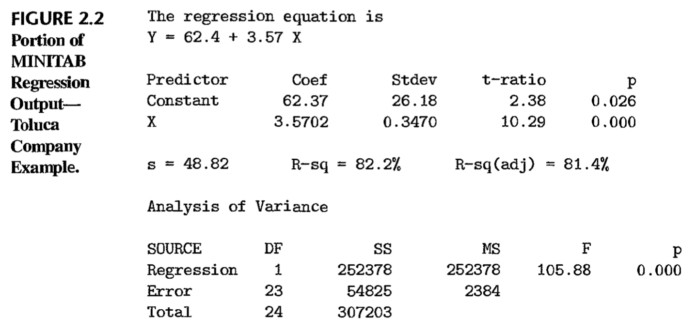

```{r setup, include=FALSE}
knitr::opts_chunk$set(echo = TRUE)
```

```{r, message=FALSE}
library(tidyverse)
library(latex2exp)
library(gridExtra)
library(wesanderson)
```


### Problem 1: 
A student working on a summer internship in the economic research department of a large corporation studied the relation between sales of a product ($Y$, in million dollars) and population ($X$, in million persons) in the firm's $50$ marketing districts. The normal error regresssion model was employed. The student first wished to test whether or not a linear association between $Y$ and $X$ existed. The student assessed a simple linear regression program and obtained the following information on the regression coefficients: 

| Parameter | Estimated Value |   95% Confidence Limits   | 
|-----------|-----------------|-------------|-------------| 
|Intercept  | 7.43119         |   -1.18518  |    16.0476  |
|Slope      | .755048         |   .452886   |     1.05721 | 

(a) The student concluded from these results that there is a linear association between $Y$ and $X$. Is the conclusion warranted? What is the implied level of significance? 

Answer: This conclusion is warranted because the slope is nonzero. The implied level of significance is 5%.

(b) Someone questioned the negative lower confidence limit for the intercept, pointing out that dollar sales cannot be negative even if the population in a district is zero. Discuss.

Answer: The context of the study must always be taken into consideration when evaluating regression results. Since dollar sales cannot be negative, a negative lower confidence limit is meaningless and should be understood as 0.00.


### Problem 2: 
In a test of the alternatives $H_0: \beta_1 \leq 0$ versus $H_A: \beta_1 > 0$, an analyst concluded $H_0$. Does this conclusion imply that there is no linear association between $X$ and $Y$? Explain.

Answer: By concluding $H_0$, the null hypothesis is failed to be rejected. This means that it can still be the case that $\beta_1 \leq 0$. This has two meanings, either $\beta_1 = 0$ signifying no linear association between $X$ and $Y$, or $\beta_1 < 0$, signifying a negative linear association between $X$ and $Y$. Thus it is not impliable that there is no linear association.


### Problem 3: 
A member of a student team playing an interactive marketing game received the following computer output when studying the relation between advertising expenditures ($X$) and sales ($Y$) for one of the team's products: 

Estimated regression equation: $\hat{Y} = 350.7 - .18X$
Two-sided $P$-value for estimated slope: $.91$

The student states: "The message I get here is that the more we spend on advertising this product, the fewer units we sell!" Comment.

Answer: The two-sided $p$-value for estimated slope is large; at an alpha level of $.05$, the $p$-value is greater and the result for the estimated slope cannot be used to create inferences about the relationship between advertisements and sales. 


### Problem 4: 
Refer to *Grade point average* Problem 1.19.

(a) Obtain a $99$ percent confidence interval for $\beta_1$. Interpret your confidence interval. Does it include zero? Why might the director of admissions be interested in whether the confidence interval includes zero?

Answer: 
```{r}
gpa = read.csv('CH01PR19.txt', sep = '', header = FALSE, 
               col.names = c('y', 'x'), 
               colClasses = c('numeric', 'numeric'))

b1_conf_interval = function(data, alpha = 0.01){
  
  X = data[['x']]
  Y = data[['y']]
  df = nrow(data) - 2
  b1 = sum((X - mean(X))*(Y - mean(Y))) / (sum((X - mean(X))^2))
  b0 = mean(Y) - b1*mean(X)
  Ypred = b0 + b1*X
  mse = sum((Y - Ypred)^2) / df
  sum_sq_Xbar = sum((X - mean(X))^2)
  t = qt(1 - (alpha/2), df = df)
  se = sqrt(mse / sum_sq_Xbar)
  error = t*se
  lower = round(b1 - error, 5)
  upper = round(b1 + error, 5)
  return(c(lower, upper))
}
```

The confidence interval for $\beta_1$ is
```{r}
b1_conf_interval(gpa, alpha = .01)
```

At a confidence of 99%, the mean ACT test score increases somewhere between $.00539$ and $.07227$ for each unit increase in the student's GPA score. The confidence interval does not include zero. It would be of importance if there was a zero because it would mean that the ACT test score does not increase when the GPA score increases on average. 


(b) Test, using the test statistic $t^*$, whether or not a linear association exists between student's ACT score ($X$) and GPA at the end of the freshman year ($Y$). Use a level of significance of $.01$. State the alternatives, decision rule and conclusion.

Answer: 
```{r}
b1_test = function(data, beta1 = 0, alpha = .01){
  
  X = data[['x']]
  Y = data[['y']]
  df = nrow(data) - 2
  b1 = sum((X - mean(X))*(Y - mean(Y))) / (sum((X - mean(X))^2))
  b0 = mean(Y) - b1*mean(X)
  Ypred = b0 + b1*X
  mse = sum((Y - Ypred)^2) / df
  sum_sq_Xbar = sum((X - mean(X))^2)
  se = sqrt(mse / sum_sq_Xbar)
  t_ast = (b1 - beta1) /se
  t = qt(1 - (alpha/2), df = df)
  
  print(paste("t* =", round(t_ast, 5)))
  if(abs(t_ast) > t){return("Conclude H_A")}
  else{return("Conclude H_0")}
}
```

For this test, let $H_0: \beta_1 = 0$ (no linear association between student's ACT score and GPA) and $H_A: \beta_1 \neq 0$ (there is linear association). Then the following $t$ statistic is computed and decision is made:
```{r}
b1_test(gpa, alpha = .01)
```

By the results of this hypothesis test, it can be concluded that there is a linear association between the ACT test scores and the students' GPA. 

(c) What is the $P$-value of your test in part (b)? How does it support the conclusion reached in part (b)?

Answer: 
```{r}
b1_test_pval = function(data, beta1 = 0, two.sided = FALSE){
  
  X = data[['x']]
  Y = data[['y']]
  df = nrow(data) - 2
  b1 = sum((X - mean(X))*(Y - mean(Y))) / (sum((X - mean(X))^2))
  b0 = mean(Y) - b1*mean(X)
  Ypred = b0 + b1*X
  mse = sum((Y - Ypred)^2) / df
  sum_sq_Xbar = sum((X - mean(X))^2)
  se = sqrt(mse / sum_sq_Xbar)
  t_ast = (b1 - beta1) /se
  pval = pt(t_ast, nrow(data)-2, lower.tail = FALSE)
  
  if(two.sided){return(round(2*pval, 5))}
  else(return(round(pval, 5)))
}
```

The $p$-value of the test is
```{r}
b1_test_pval(gpa, two.sided = TRUE)
```

Since this $p$-value is less than $\alpha = .01$, reject $H_0$ and accept $H_A$. This is the same conclusion reached in part (b).


### Problem 5: 
Refer to *Copier maintenance* Problem 1.20.

(a) Estimate the change in the mean service time when the number of copiers serviced increases by one. Use a $90$ percent confidence interval Interpret your confidence interval.

Answer:
```{r}
copier = read.csv('CH01PR20.txt', sep = '', header = FALSE, 
                  col.names = c('y', 'x'), 
                  colClasses = c('numeric', 'numeric'))

b1_conf_interval(copier, alpha = .1)
```

With 90% confidence, the change in the mean service time when the number of copiers serviced increases by one is between $14.22314$ and $15.84735$. 

(b) Conduct a $t$ test to determine whether or not there is a linear association between $X$ and $Y$ here; control the $\alpha$ risk at $.10$. State the alternatives, decision rule and conclusion. What is the $P$-value of your test?

Answer: Let the null hypothesis be that there is no linear association between service time and number of copiers. Let the alternative hypothesis be that there is a linear association. Then by the $t$ test, 
```{r}
b1_test(copier, alpha = .1)
```

There is a linear association between $X$ and $Y$. The $p$-value of the test is
```{r}
b1_test_pval(copier, two.sided = TRUE)
```


(c) Are your results in part (a) and (b) consistent? Explain.

Answer: The results in part (a) and (b) are consistent; both tell that there is a linear association between $X$ and $Y$.

(d) The manufacturer has suggested that the mean required time should not increase by more than $14$ minutes for each additional copier that is serviced on a service call. Conduct a test to decide whether this standard is being satisfied by Tri-City. Control the risk of a Type I error at $.05$. State the alternatives, decision rule and conclusion. What is the $P$-value of the test?

Answer: Let the null hypothesis be that the mean required time is less than or equal to $14$ minutes and the alternative hypothesis be that the mean required time is greater than $14$ minutes. Then the decision rule is
```{r}
b1_test(copier, beta1 = 14, alpha = .05)
```

According to the $t$ test, the mean required time is greater than $14$ minutes. The standard given by the manufacturer is no being satisfied by Tri-City. The $p$-value of the test is
```{r}
b1_test_pval(copier, beta1 = 14)
```

Since the $p$ value is less than $\alpha = .01$, the null is rejected and the alternative is accepted. This is the same conclusion made above.

(e) Does $b_0$ give any relevant information here about the "start-up" time on calls - i.e., about the time required before service work is begun on the copiers at a customer location? 

```{r}
lm.fit_manual = function(X, Y){
  b1 = sum((X - mean(X))*(Y - mean(Y))) / (sum((X - mean(X))^2))
  b0 = mean(Y) - b1*mean(X)
  return(c(b0, b1))
}

lm.fit_manual(copier$x, copier$y)
```

According to the linear regression model, the $b_0$ coefficient is $-0.58$. This value is negative, implying negative time. It is meaningless in this context. It does not give any relevant information about the "start-up" time on calls.

### Problem 6:
Refer to *Airfreight breakage* Problem 1.21.

(a) Estimate $\beta_1$ with a $95$ percent confidence interval. Interpret your interval estimate.

Answer: 
```{r}
airfreight = read.csv('CH01PR21.txt', sep = '', header = FALSE, 
                  col.names = c('y', 'x'), 
                  colClasses = c('numeric', 'numeric'))
b1_conf_interval(airfreight, alpha = .05)
```

At the alpha level of $.05$, the number of broken ampules is estimated to increase between $2.91839$ and $5.08161$ for each time a carton is transferred.

(b) Conduct a $t$ test to decide whether or not there is a linear association between number of times a carton is transferred ($X$) and number of broken ampules ($Y$). Use a level of significance of $.05$. State the alternatives, decision rule and conclusion. What is the $P$-value of the test? 

Answer: Let the null hypothesis be that there is no linear association between number of times a carton is transferred and number of broken ampules. Let the alternative hypothesis be that there is a linear association between the two. Then the decision rule is 
```{r}
b1_test(airfreight, alpha = .05)
```

There is a linear association between the two variables. The $p$-value of this test is
```{r}
b1_test_pval(airfreight, two.sided = TRUE)
```

(c) $\beta_0$ represents here the mean number of ampules broken when no transfers of the shipment are made, i.e., when $X=0$. Obtain a $95$ percent confidence interval for $\beta_0$ and interpret it.

Answer: 
```{r}
b0_conf_interval = function(data, alpha = 0.01){
  
  X = data[['x']]
  Y = data[['y']]
  df = nrow(data) - 2
  b1 = sum((X - mean(X))*(Y - mean(Y))) / (sum((X - mean(X))^2))
  b0 = mean(Y) - b1*mean(X)
  Ypred = b0 + b1*X
  mse = sum((Y - Ypred)^2) / df
  se_estimator = nrow(data)^(-1) + (mean(X)^2 / sum((X - mean(X))^2))
  t = qt(1 - (alpha/2), df = df)
  se = sqrt(mse * se_estimator)
  error = t*se
  lower = round(b0 - error, 5)
  upper = round(b0 + error, 5)
  return(c(lower, upper))
}
```


The $95$ percent confidence interval for $\beta_0$ is
```{r}
b0_conf_interval(airfreight, alpha = .05)
```

When there are no transfers of the shipment made, the mean number of ampules broken lies between $8.67037$ and $11.72963$ with $95\%$ confidence. 

(d) A consultant has suggested, on the basis of previous experience, that the mean number of broken ampules should not exceed $9.0$ when no transfers are made. Conduct an appropriate test, using $\alpha = .025$. State the alternatives, decision rule and conclusion. What is the $P$-value of the test?

Answer: 
```{r}
b0_test_pval = function(data, beta0 = 0, two.sided = FALSE){
  
  X = data[['x']]
  Y = data[['y']]
  df = nrow(data) - 2
  b1 = sum((X - mean(X))*(Y - mean(Y))) / (sum((X - mean(X))^2))
  b0 = mean(Y) - b1*mean(X)
  
  Ypred = b0 + b1*X
  mse = sum((Y - Ypred)^2) / df
  se_estimator = nrow(data)^(-1) + (mean(X)^2 / sum((X - mean(X))^2))
  se = sqrt(mse * se_estimator)
  t_ast = (b0 - beta0) / se
  pval = pt(t_ast, nrow(data)-2, lower.tail = FALSE)
  
  if(two.sided){return(round(2*pval, 5))}
  else(return(round(pval, 5)))
}
```

Let the null hypothesis be that $\beta_0 \leq 9$ and the alternative that $\beta_0 > 9$. Then at an alpha level of $.025$, the p-value is 
```{r}
b0_test_pval(airfreight, beta0 = 9)
```

Since this value is not less than $\alpha$, fail to reject $H_0$; there is no sufficient evidence that the mean number of broken ampules will not exceed $9.0$ when no transfers are made.

(e) Obtain the power of your test in part (b) if actually $\beta_1 = 2.0$. Assume $\sigma[b_1] = .50$. Also obtain the power of your test in part (d) if actually $\beta_0 = 11$. Assume $\sigma[b_0] = .75$. 

Answer: Let the null hypothesis be that $\beta_1 = 9$ for the first scenario. Then 
$$ \delta = \frac{\lvert 2-0 \rvert}{.5} = 4 $$ 
```{r}
power_test = function(data, conf = .95, delta = 0){
  
  t = qt(conf, df = nrow(data) - 2)
  df = nrow(data) -2 
  p = pt(t, df = df, ncp = delta) - pt(-t, df = df, ncp = delta)
  return(1-p)
  
}
```

Then the power of the test is
```{r}
power_test(airfreight, conf = .975, delta = 4)
```

For the second scenario, let the null hypothesis be that $\beta_0 = 11$. Then
$$ \delta = \frac{\lvert 11 - 9 \rvert}{.75} = \frac{8}{3} $$

Then the power of the test is
```{r}
power_test(airfreight, conf = .95, delta = 8/3)
```


### Problem 7:
Refer to *Plastic Hardness* Problem 1.22.

(a) Estimate the change in the mean hardness when the elapsed time increases by one hour. Use a $99$ percent confidence interval. Interpret your interval estimate.

Answer: 
```{r}
plastic = read.csv('CH01PR22.txt', sep = '', header = FALSE, 
                  col.names = c('y', 'x'), 
                  colClasses = c('numeric', 'numeric'))

b1_conf_interval(plastic, alpha = .01)
```

When the elapsed time increases by one hour, the change in the mean hardness ranges from $1.76529$ to $2.30346$ with $99\%$ confidence.

(b) The plastic manufacturer has stated that the mean hardness should increase by $2$ Brinell units per hour. Conduct a two-sided test to decide whether this standard is being satisfied; use $\alpha = .01$. State the alternatives, decision rule and conclusion. What is the $P$-value of the test?

Answer: Let the null hypothesis be that $\beta_1 = 2$ and the alternative that $\beta_1 \neq 2$. Then the $p$-value of this test is
```{r}
b1_test_pval(plastic, beta1 = 2, two.sided = TRUE)
```

Since this $p$ value is larger than $\alpha = .01$, fail to reject the null hypothesis. There is no sufficient evidence that the mean hardness should increase by $2$ Brinell units per hour.

(c) Obtain the power of your test in part (b) if the standard actually is being exceeded by $.3$ Brinell units per hour. Assume $\sigma[b_1] = .1$.

Answer: Let the null hypothesis be that $\beta_1 = .3$. Then
$$ \delta = \frac{\lvert .3 \rvert}{.1} = 3$$ 

Then the power of the test is 
```{r}
power_test(plastic, conf = .99, delta = 3)
```


### Problem 8: 
Refer to Figure 2.2 for the Toluca Company example. A consultant has advised that an increase of one unit in a lot size should require an increase of $3.0$ in the expected number of work hours for the given production item.

{#id .class width=50% height=50%}

(a) Conduct a test to decide whether or not the increase in the expected number of work hours in the Toluca Company equals this standard. Use $\alpha = .05$. State the alternatives, decision rule and conclusion.

Answer: Let the null hypothesis be that $\beta_1 = 3$ and the alternative that $\beta_1 \neq 3$. Then by inputting in the values from the MINITAB output, the calculated $t$ value is,
```{r}
(3.57 - 3)/.3470
```

Now, $t_{.975, 23}$ is
```{r}
qt(.975, 23)
```

The calculated $t$ value is less than the $t$ statistic above. Hence fail to reject $H_0$; there is no sufficient evidence that the increase in the expected number of work hours in the Toluca Company equals $3.0$.

(b) Obtain the power of your test in part (a) if the consultant's standard actually is being exceeded by $.5$ hour. Assume $\sigma[b_1] = .35$.

Answer: Let the null hypothesis be that $\beta_1 = .5$. Then
$$ \delta = \frac{\lvert .5 \rvert}{.35} = \frac{10}{7} $$ 

Then the power of the test is
```{r}
power_test(data.frame(rep(2020, 25)), conf = .95, delta = 10/7)
```

(c) Why is $F^* = 105.88$, given in the printout, not relevant for the test in part (a)? 

Answer: The $F$ statistic is not relevant for the $t$ test in part (a) because the hypothesis $\beta_1 = 0$ was not being tested. 


### Problem 9: 
Refer to Figure 2.2. A student, noting that, $s[b_1]$ is furnished in the printout, asks why $s[\hat{Y}_h]$ is not also given. Discuss.

Answer: $\hat{Y}_h$ refers to any single predicted $Y$ value. The variability of the sampling distribution of $\hat{Y}_h$ is affected by how far $X_h$ is from $\overline{X}$, through the term $(X_h - \overline{X})^2$. The standard deviation of $\hat{Y}_h$ would differ point by point and cannot be given for a regression line.


### Problem 10: 
For each of the following questions, explain whether a confidence interval for a mean response or a prediction interval for a new observation is appropriate.

(a) What will be the humidity level in this greenhouse tomorrow when we set the temperature at $31^\circ C$? 

Answer: A prediction interval for a new observation would be appropriate here.

(b) How much do families whose disposable income is $\$23,500$ spend, on the average, for meals away from home?

Answer: A confidence interval for a mean response would be appropriate here.

(c) How many kilowatts-hours of electricity will be consumed next month by commercial and industrial users in the Twin Cities service area, given that the index of business activity for the area remains at its present level? 

Answer: A prediction interval for a new observation would be appropriate here.


### Problem 11: 
A person asks if there is a difference between the "mean response at $X=X_h$" and the "mean of $m$ new observations at $X=X_h$". Reply.

Answer: There is a difference between the "mean response at $X=X_h$" and the "mean of $m$ new observations at $X=X_h$ because the former samples one new point and the latter samples $m$ new points.


### Problem 12: 
Can $\sigma^2[\text{pred}]$ be brought increasingly close to $0$ as $n$ becomes large? Is this also the case for $\sigma^2[\hat{Y}_h]$? What is the implication of this difference? 

Answer: As $n$ becomes large, $\sigma^2[\text{pred}]$ cannot be brought increasingly closer to $0$ due to the presense of the $\sigma^2$ and $\sigma^2[\hat{Y}_h]$. This is the same for $\sigma^2[\hat{Y}_h]$ because it is dependent on a term for the deviation of $X_h$ from $\overline{X}$. The implication of the difference is that one depends on the variance of one new point and the other depends on the the variance of $n$ new points. 


### Problem 13: 
Refer to *Grade point average* Problem 1.19.

(a) Obtain a $95$ percent interval estimate of the mean freshman GPA for students whose ACT test score is $28$. Interpret your confidence interval.

Answer: 
```{r}
gpa = read.csv('CH01PR19.txt', sep = '', header = FALSE, 
               col.names = c('y', 'x'), 
               colClasses = c('numeric', 'numeric'))

Yhat_conf_interval = function(data, Xhat, alpha = 0.01){
  
  X = data[['x']]
  Y = data[['y']]
  df = nrow(data) - 2
  b1 = sum((X - mean(X))*(Y - mean(Y))) / (sum((X - mean(X))^2))
  b0 = mean(Y) - b1*mean(X)
  Ypred = b0 + b1*X
  Yhat = b0 + b1*Xhat
  mse = sum((Y - Ypred)^2) / df
  var_adjust = (1/nrow(data)) + ((Xhat - mean(X))^2)/sum((X - mean(X))^2)
  t = qt(1 - (alpha/2), df = df)
  se = sqrt(mse * var_adjust)
  error = t*se
  lower = round(Yhat - error, 5)
  upper = round(Yhat + error, 5)
  return(c(lower, upper))
}
```

The confidence interval is
```{r}
Yhat_conf_interval(gpa, Xhat = 28, alpha = .05)
```

(b) Mary Jones obtained a score of $28$ on the entrance test. Predict her freshman GPA using a $95$ percent prediction interval. Interpret your prediction interval.

Answer: 
```{r}
Yhat_pred_interval = function(data, Xhat, alpha = 0.01){
  
  X = data[['x']]
  Y = data[['y']]
  df = nrow(data) - 2
  b1 = sum((X - mean(X))*(Y - mean(Y))) / (sum((X - mean(X))^2))
  b0 = mean(Y) - b1*mean(X)
  Ypred = b0 + b1*X
  Yhat = b0 + b1*Xhat
  mse = sum((Y - Ypred)^2) / df
  var_adjust = (1/nrow(data)) + ((Xhat - mean(X))^2)/sum((X - mean(X))^2) + 1
  t = qt(1 - (alpha/2), df = df)
  se = sqrt(mse * var_adjust)
  error = t*se
  lower = round(Yhat - error, 5)
  upper = round(Yhat + error, 5)
  return(c(lower, upper))
}
```

The prediction interval is
```{r}
Yhat_pred_interval(gpa, Xhat = 28, alpha = .05)
```

(c) Is the prediction interval in part (b) wider than the confidence interval in part (a)? Should it be? 

Answer: The prediction interval in part (b) is wider than the confidence interval in part (a). This was expected due to the added variability in $\hat{Y}$.

(d) Determine the boundary value of the $95$ percent confidence band for the regression line when $X_h = 28$. Is your confidence band wider at this point than the confidence interval in part (a)? Should it be? 

Answer: 
```{r}
conf_band_reg = function(data, Xhat, alpha = 0.01){
  
  X = data[['x']]
  Y = data[['y']]
  df = nrow(data) - 2
  W = sqrt(2* qf(1 - alpha, 2, df))
  b1 = sum((X - mean(X))*(Y - mean(Y))) / (sum((X - mean(X))^2))
  b0 = mean(Y) - b1*mean(X)
  Ypred = b0 + b1*X
  Yhat = b0 + b1*Xhat
  mse = sum((Y - Ypred)^2) / df
  var_adjust = (1/nrow(data)) + ((Xhat - mean(X))^2)/sum((X - mean(X))^2)
  t = qt(1 - (alpha/2), df = df)
  se = sqrt(mse * var_adjust)
  error = W*se
  lower = round(Yhat - error, 5)
  upper = round(Yhat + error, 5)
  return(c(lower, upper))
}
```

The boundary values of the $95$ percent confidence band for the regression line when $X_h = 28$ is
```{r}
conf_band_reg(gpa, 28, alpha = .05)
```

The confidence band is wider at this point than the confidence band in part (a), as was expected.

### Problem 14: 
Refer to *Copier maintenance* Problem 1.20.

(a) Obtain a $90$ percent confidence interval for the mean service time on calls in which six copiers are serviced. Interpret your confidence interval.

Answer: The $90$ percent confidence interval for the mean service time on calls in which six copiers are serviced is
```{r}
Yhat_conf_interval(copier, Xhat = 6, alpha = .1)
```

(b) Obtain a $90$ percent prediction interval for the service time on the next call in which six copiers are serviced. Is your prediction interval wider than the corresponding confidence interval in part (a)? Should it be? 

Answer: The $90$ percent prediction interval is
```{r}
Yhat_pred_interval(copier, Xhat = 6, alpha = .1)
```

The prediction interval is wider than the corresponding confidence interval, as was expected.

(c) Management wishes to estimate the expected service time **per copier** on calls in which six copiers are serviced. Obtain an appropriate $90$ percent confidence interval by converting the interval obtain in part (a). Interpret the converted confidence interval.

Answer: The appropriate $90$ percent confidence interval for the expected service time **per copier** on calls is
```{r}
Yhat_conf_interval(copier, Xhat = 6, alpha = .1) / 6
```

The service time for one copier on call is between $14.54731$ and $15.32980$ minutes, with $90$ percent confidence. 

(d) Determine the boundary values of the $90$ percent confidence band for the regression line when $X_h = 6$. Is your confidence band wider at this point than the confidence interval in part (a)? Should it be? 

Answer: The boundary values are
```{r}
conf_band_reg(copier, Xhat = 6, alpha = .1)
```

The confidence band is wider than the confidence interval in part (a). This was expected.

### Problem 15: 
Refer to *Airfreight breakage* Problem 1.21.

(a) Because of changes in airline routes, shipments may have to be transferred more frequently than in the past. Estimate the mean breakage for the following numbers of transfers: $X=2,4$. Use separate $99$ percent confidence intervals. Interpret your results.

Answer: The confidence interval for the mean breakage when there are $2$ transfers is
```{r}
Yhat_conf_interval(airfreight, Xhat = 2, alpha = .01)
```

The confidence interval for the mean breakage when there are $4$ transfers is
```{r}
Yhat_conf_interval(airfreight, Xhat = 4, alpha = .01)
```

The mean number of broken ampules is larger when there are more transfers. Furthermore, the width of the confidence interval is greater when there are more transfers. 

(b) The next shipment will entail two transfers. Obtain a $99$ percent prediction interval for the number of broken ampules for this shipment. Interpret your prediction interval.

Answer: 
```{r}
Yhat_pred_interval(airfreight, Xhat = 2, alpha = .01)
```

The mean number of broken ampules lies between $12.74814$ and $23.65186$ when there are two transfers, with $99$ percent confidence. 

(c) In the next several days, three independent shipments will be made, each entailing two transfers. Obtain a $99$ percent prediction interval for the mean number of ampules broken in the three shipments. Convert this interval into a $99$ percent prediction interval for the total number of ampules broken in the three shipments.

Answer: 
```{r}
Yhat_m_pred_interval = function(data, Xhat, m, alpha = 0.01){
  
  X = data[['x']]
  Y = data[['y']]
  df = nrow(data) - 2
  b1 = sum((X - mean(X))*(Y - mean(Y))) / (sum((X - mean(X))^2))
  b0 = mean(Y) - b1*mean(X)
  Ypred = b0 + b1*X
  Yhat = b0 + b1*Xhat
  mse = sum((Y - Ypred)^2) / df
  var_adjust = (1/nrow(data)) + (1/m) + ((Xhat - mean(X))^2)/sum((X - mean(X))^2)
  t = qt(1 - (alpha/2), df = df)
  se = sqrt(mse * var_adjust)
  error = t*se
  lower = round(Yhat - error, 5)
  upper = round(Yhat + error, 5)
  return(c(lower, upper))
}
```

The $99$ percent prediction interval for the mean number of ampules broken in the three shipments is
```{r}
Yhat_m_pred_interval(airfreight, Xhat = 2, m = 3, alpha = .01)
```

The $99$ percent prediction interval for the total number of broken ampules in the three shipments is then
```{r}
3*Yhat_m_pred_interval(airfreight, Xhat = 2, m = 3, alpha = .01)
```

(d) Determine the boundary values of the $99$ percent confidence band for the regression line when $X_h=2$ and when $X_h=4$. Is your confidence band wider at these two points than the corresponding confidence intervals in part (a)? Should it be? 

Answer: The boundary values of the $99$ percent confidence band for the regression line when $X_h = 2$ is 
```{r}
conf_band_reg(airfreight, Xhat = 2, alpha = .01)
```

The boundary values of the $99$ percent confidence band for the regression line when $X_h = 4$ is
```{r}
conf_band_reg(airfreight, Xhat = 4, alpha = .01)
```

The confidence bands are wider at these two points than the corresponding confidence intervals in part (a), as was expected.

### Problem 16: 
Refer to *Plastic hardness* Problem 1.22.

(a) Obtain a $98$ percent confidence interval for the mean hardness of molded items with an elapsed time of $30$ hours. Interpret your confidence interval. 

Answer: The $98$ percent confidence interval for the mean hardness of molded items with an elapsed time of $30$ hours is
```{r}
Yhat_conf_interval(plastic, Xhat = 30, alpha = .02)
```

The mean hardness of molded times, with an elapsed time of $30$ hours, lies between $227.4569$ and $231.8056$ Brinell units, with $98$ percent confidence.

(b) Obtain a $98$ percent prediction interval for the hardness of a newly molded test item with an elapsed time of $30$ hours.

Answer: The $98$ percent prediction interval for the hardness of a newly molded test item with an elapsed time of $30$ hours is
```{r}
Yhat_pred_interval(plastic, Xhat = 30, alpha = .02)
```

(c) Obtain a $98$ percent prediction interval for the mean hardness of $10$ newly test items, each with an elapsed time of $30$ hours.

Answer: The $98$ percent prediction interval for the mean hardness of $10$ newly test items, each with an elapsed time of $30$ hours, is
```{r}
Yhat_m_pred_interval(plastic, Xhat = 30, m = 10, alpha = .02)
```

(d) Is the prediction interval in part (c) narrower than the one in part (b)? Should it be? 

Answer: The prediction interval in part (c) is narrower than the one in part (b) since there are multiple new test items involved. This should be expected.

(e) Determine the boundary values of the $98$ percent confidence band for the regression line when $X_h = 30$. Is your confidence band wider at this point than the confidence interval in part (a)? Should it be? 

Answer: The boundary values of the $98$ percent confidence band for the regression line when $X_h = 30$ is 
```{r}
conf_band_reg(plastic, Xhat = 30, alpha = .02)
```

This confidence band is wider at this point than the confidence interval in part (a), as was expected. 

### Problem 17: 
An analyst fitted a normal error regression model and conducted an $F$ test of $\beta_1 = 0$ vs $\beta_ \neq 0$. The $P$-value of the test was $.033$ and the analyst concluded $H_A: \beta_1 \neq 0$. Was the $\alpha$ level used by the analyst greater than or smaller than $.033$? If the $\alpha$ level had been $.01$, what would have been the appropriate conclusion? 

Answer: Since the analyst rejected the null hypothesis, it can be assumed that the $\alpha$ level had to be greater than $0.33$. If the $\alpha$ level had been $0.01$, the appropriate conclusion would be to fail to reject the null hypothesis. 


### Problem 18: 
For conducting statistical tests concerning the parameter $\beta_1$, why is the $t$ test more versatile than the $F$ test? 

Answer: The $t$ test is more versatile than the $F$ test in this scenario because it can be used for one sided alternatives. 

### Problem 19: 
When testing whether or not $\beta_1 = 0$, why the $F$ test a one-sided test even though $H_A$ includes both $\beta_1 < 0$ and $\beta_1 > 0$? 

Answer: The $F$ test is a one-sided test because it calculates the probability of $F^*$ being larger than $F_{1, n-2}$, the $(1-\alpha)100$ percentile of the appropriate $F$ distribution.


### Problem 20: 
A student asks whether $R^2$ is a point estimator of any parameter in the normal error regression model. Respond.

Answer: $R^2$ is not a point estimator of any parameter in the normal error regression model. 


### Problem 21: 
A value of $R^2$ near $1$ is sometimes interpreted to imply that the relation between $Y$ and $X$ is sufficiently close so that suitably precise precisions of $Y$ can be made from knowledge of $X$. Is this implication a necessary consequence of the definition of $R^2$? 

Answer: The definition of $R^2$ is "the proportionate reduction of total variation associated with the use of the predictor variable $X$". This is the opposite of what the implication is saying, so no, it is not a necessary consequence of the definition of $R^2$. 


### Problem 22: 
Using the normal error regression model in an engineering safety experiment, a researcher found for the first $10$ cases that $R^2$ was zero. Is it possible for that for the complete set of $30$ cases $R^2$ will not be zero? Could $R^2$ not be zero for the first $10$ cases, yet equal zero for all $30$ cases> Explain.

Answer: It is possible for the $R^2$ for all $30$ cases to be non-zero if for the first $10$ it was since the latter $20$ cases can have reduction in variation of $Y$ by an explanatory variable. Likewise, it is also possible for $R^2$ is not be zero for the first $10$ cases and yet equal zero for all $30$ cases because the sum of squared residuals can be equal to zero when all $30$ cases are looked. 


### Problem 23: 
Refer to *Grade point average* Problem 1.19.

(a) Set up the ANOVA table.

Answer: 
```{r}
simple_anova = function(data, x, y){
  
  X = data$x
  Y = data$y
  Ybar = mean(Y)
  
  coefs = lm.fit_manual(X, Y)
  preds = coefs[1] + coefs[2]*X

  SSR_reg = sum((preds - Ybar)^2)
  df_reg = 1
  MS_reg = SSR_reg/df_reg
  
  SSE_error = sum((Y - preds)^2)
  df_error = nrow(data) - 2
  MS_error = SSE_error/df_error
  
  SSTO = SSR_reg + SSE_error
  df_total = nrow(data) -1
  
  return(data.frame("source of variation" = c("Regression", "Error", "Total"), 
                    "SS" = c(SSR_reg, SSE_error, SSTO),
                    "df" = c(df_reg, df_error, df_total),
                    "Mean Squares" = c(MS_reg, MS_error, NA)))
}

simple_anova(gpa, x, y)
```

(b) What is estimated by MSR in your ANOVA table? by MSE? Under what conditions do MSR and MSE estimate the same quantity? 

Answer: The MSR estimates the mean of the sampling distribution of the regression while MSE estimates the mean of the sampling distribution of the errors (or residuals). In equation form, the MSR is $\sigma^2 + \beta_1^2\sum (X_i - \overline{X})^2$ and MSE is $\sigma^2$.  MSR and MSE estimate the same quantity when the sampling distribution of MSR and MSE are located identically. This happens when $\beta_1 = 0$. 

(c) Conduct an $F$ test of whether or not $\beta_1 = 0$. Control the $\alpha$ risk at $.01$. State the alternatives, decision rule and conclusion.

Answer: 
```{r}
ftest = function(data, alpha = 0.05){
  
  X = data$x
  Y = data$y
  
  coefs = lm.fit_manual(X, Y)
  preds = coefs[1] + coefs[2]*X

  SSR_reg = sum((preds - mean(Y))^2)
  df_reg = 1
  MS_reg = SSR_reg/df_reg
  
  SSE_error = sum((Y - preds)^2)
  df_error = nrow(data) - 2
  MS_error = SSE_error/df_error
  
  F_ast = round(MS_reg/MS_error, 3)
  
  if(F_ast > rf(1, alpha, df_error)){
    paste("At the alpha level of", alpha, "the calculated F statistic is", F_ast, 
          "and the decision is to reject H_0. beta_1 is not equal to zero.", sep = ' ')
  }
  else{
    paste("At the alpha level of", alpha, "the calculated $F$ statistic is", F_ast,
          "and the decision is to fail to reject H_0. There is no sufficicent evident for beta_1 to not be zero", sep = ' ')
  }
}

ftest(gpa, alpha = 0.01)
```

(d) What is the absolute magnitude of the reduction in the variation of $Y$ when $X$ is introduced into the regression model? What is the relative reduction? What is the name of the latter measure? 

Answer: 

```{r}
SSR = function(data){
  
  X = data$x
  Y = data$y
  
  coefs = lm.fit_manual(X, Y)
  preds = coefs[1] + coefs[2]*X

  SSR_reg = sum((preds - mean(Y))^2)
  return(SSR_reg)
}

SSTO = function(data){
  
  X = data$x
  Y = data$y
  
  coefs = lm.fit_manual(X, Y)
  preds = coefs[1] + coefs[2]*X

  SSR_reg = sum((preds - mean(Y))^2)
  SSE_error = sum((Y - preds)^2)
  SSTO = SSR_reg + SSE_error
  return(SSTO)
  
}

R2_manual = function(sse, ssto){return(paste(round(100 * sse/ssto, 3), "%", sep = ''))}
```

The absolute magnitude of the reduction in the variation of $Y$ when $X$ is introduced into the regression model is
```{r}
SSR(gpa)
```

and the relative reduction is
```{r}
R2_manual(SSR(gpa), SSTO(gpa))
```

(e) Obtain $r$ and attach the appropriate sign.

Answer: 
```{r}
r_manual = function(sse, ssto, sign){return(paste(sign, round(sqrt(sse/ssto), 3)))}
```

To determine the sign of $r$, look at the plot of $X$ vs $Y$.
```{r}
plot(gpa$x, gpa$y)
```

The association between $X$ and $Y$ appears to be positively linear and and thus $r$ is
```{r}
r_manual(SSR(gpa), SSTO(gpa), "+")
```

(f) Which measure, $R^2$ or $r$ has the more clear-cut operational interpretation? Explain.

Answer: A more clear-cut operational interpretation can be made from $R^2$ because it tells how much of the variability in $Y$ can be explained by $X$. 


### Problem 24: 
Refer to *Copier maintenance* Problem 1.20.

(a) Set up the basic ANOVA table. Which elements of your table are additive? Also set up the modified ANOVA table. How do the two tables differ? 

Answer: 

The ANOVA table tooks like
```{r}
simple_anova(copier)
```

The sum of squared row is additive as well as degrees of freedom.

```{r}
modified_anova = function(data){
  
  basic_anova = simple_anova(data)
  
  SS_correction = nrow(data)*(mean(data$y)^2)
  df_correction = 1
  
  SSTOU = sum((data$y)^2)
  df_total = nrow(data)
  
  mod_anova = basic_anova %>% 
    add_row(source.of.variation = "Correction for Mean", SS = SS_correction, df = df_correction) %>%
    add_row(source.of.variation = "Total, uncorrected", SS = SSTOU, df = df_total)
  
  return(mod_anova)
}
```


The modified ANOVA table looks like
```{r}
modified_anova(copier)
```

These two differ such that the modified table shows how much sum of squares was uncorrected as ell as the the correction for the mean sum of squares. 

(b) Conduct an $F$ test to determine whether or not there is a linear association between time spent and number of copiers serviced; use $\alpha=.10$. State the alternatives, decision rule and conclusion.

Answer: Let the null hypothesis be that there is no linear association between time spent and number of copiers served, and the alternative hypothesis that there is a linear association between the two. Then
```{r}
ftest(copier, alpha = .1)
```

Thus there is a linear association between the two variables.

(c) By how much, relatively, is the total variation in number of minutes spent on a call reduced when the number of copiers servied is introduced into the analysis? Is this a relatively small or large reduction? What is the name of this measure? 

Answer: The absolute magnitude of the reduction in the variation in number of minutes spent on a call reduced when the number of copiers serviced is introduced into the regression model is
```{r}
SSR(copier)
```

and the relative reduction is
```{r}
R2_manual(SSR(copier), SSTO(copier))
```

This is a large reduction, given by the relative reduction, or coefficient of determination. 

(d) Calculate $r$ and attach the appropriate sign.

Answer: 
```{r}
plot(copier$x, copier$y)
```

Given the correlation between $X$ and $Y$ is positive, the value of $r$ is 
```{r}
r_manual(SSR(copier), SSTO(copier), "+")
```

(e) Which measure, $r$ or $R^2$, has the more clear-cut operational interpretation? 

Answer: The $R^2$ has the more clear-cut operational interpretation. 


### Problem 25: 
Refer to *Airfreight breakage* Problem 1.21.

(a) Set up the ANOVA table. Which elements are additive? 

Answer: The ANOVA table looks like
```{r}
simple_anova(airfreight)
```

The elements that are additive are sum of squares and degrees of freedom.

(b) Conduct an $F$ test to decide whether or not there is a linear association between the number of times a carton is transferred and the number of broken ampules; control the $\alpha$ risk at $.05$. State the alternatives, decision rule and conclusion.

Answer: Let the null hypothesis be that there is no linear association between the number of times a carton is transferred and the number of broken ampules. Then
```{r}
ftest(airfreight, alpha = .05)
```

Therefore there is a linear association.

(c) Obtain the $t^*$ statistic for the test in part (b) and demonstrate numerically its equivalence to the $F^*$ statistic obtained in part (b)? 

Answer: The $t^*$ statistic is calculated to be $$ t^* = \frac{b_1 - 0}/{se[b_1]} $$ where $$se[b_1] = \frac{\text{MSE}}{(\sum (X_i - \overline{X})^2)} $$ The $t^*$ statistic for the test in part (b) is
```{r}
lm.fit_manual(airfreight$x, airfreight$y)[2]  / ((2.2/ sum((airfreight$x - mean(airfreight$x))^2))^.5)
```

The relationship between $t^*$ and $F$ is $$ (t^*)^2 = F^* $$

The $t^*$ statistic squared is
```{r}
(lm.fit_manual(airfreight$x, airfreight$y)[2]  / ((2.2/ sum((airfreight$x - mean(airfreight$x))^2))^.5))^2
```

This is the $F^*$ statistic calculated above.

(d) Calculate $R^2$ and $r$. What proportion of the variation in $Y$ is accounted for by introducing $X$ into the regression model? 

Answer: The $R^2$ is
```{r}
R2_manual(SSR(airfreight), SSTO(airfreight))
```
This is the proportion of in $Y$ accounted for by introducing $X$ into the regression model.

```{r}
plot(airfreight$x, airfreight$y)
```

A plot of the variables shows a positive correlation and so the $r$ value is
```{r}
r_manual(SSR(airfreight), SSTO(airfreight), "+")
```


### Problem 26: 
Refer to *Plastic hardness* Problem 1.22.

(a) Set up the ANOVA table.

Answer: The ANOVA table looks like
```{r}
simple_anova(plastic)
```

(b) Test by means of an $F$ test whether or not there is a linear association between the hardness of the plastic and the elapsed time. Use $\alpha = .01$. State the alternatives, decision rule and conclusion.

Answer: Let the null hypothesis be that there is no linear assoication between the hardness of the plastic and the elapsed time. Let the alternative hypothesis be that there is a linear association between the two. Then the $F$ test reveals that
```{r}
ftest(plastic, alpha = .01)
```

There is a linear association between the two variables. 

(c) Plot the deviations $Y_i - \hat{Y}_i$ against $X_i$ on a graph. Plot the deviations $\hat{Y}_i - \overline{Y}$ against $X_i$ on another graph, using the same scales as for the first graph. From your two graphs, does SSE or SSR appear to be the larger component of SSTO? What does this imply about the magnitude of $R^2$?

Answer: 
```{r}
model = lm.fit_manual(plastic$x, plastic$y)
Yhat = model[1] + model[2]*plastic$x
Ybar = mean(plastic$y)

dev1 = plastic$y - Yhat
dev2 = Yhat - Ybar

data.frame(x = plastic$x, dev1, dev2) %>% 
  gather(dev, val, dev1, dev2) %>% 
  ggplot(aes(x = x, y = val, color = dev)) + 
  geom_point() + 
  scale_color_manual(labels = c("Y - Yhat", "Yhat - Ybar"),
                       values = c("aquamarine4", "darkblue")) + 
  labs(x = "x", y = "deviations", 
       color = "Type", 
       title = TeX('Deviations Plot of $Y_i - \\hat{Y}_i$ and $\\hat{Y}_i - \\bar{Y}$')) + 
  theme_classic()
```

It appears to be that the larger component of SSTO is $\hat{Y} - \overline{Y}$, or SSR. This implies that the magnnitude of $R^2$ is large. 

(d) Calculate $R^2$ and $r$. 

Answer: he $R^2$ is
```{r}
R2_manual(SSR(plastic), SSTO(plastic))
```
This is the proportion of in $Y$ accounted for by introducing $X$ into the regression model.

```{r}
plot(plastic$x, plastic$y)
```

A plot of the variables shows a positive correlation and so the $r$ value is
```{r}
r_manual(SSR(plastic), SSTO(plastic), "+")
```


### Problem 27: 
Refer to *Muscle mass* Problem 1.27.

(a) Conduct a test to decide whether or not there is a negative linear association between amount of muscle mass and age. Control the risk of Type I error at $.05$. State the alternatives, decision rule and conclusion. What is the $P$-value of the test? 

Answer: Let the null hypothesis be that there there is a positive or zero linear association between amount of muscle mass and age, or $\beta_1 \geq 0$. Let the alternative hypothesis be that there is a negative linear association between the two. Then the $t$ test reveals that
```{r}
muscle = read.csv('CH01PR27.txt', sep = '', header = FALSE, 
                  col.names = c('y', 'x'), 
                  colClasses = c('numeric', 'numeric'))

b1_test(muscle, alpha = .05)
```

According to the $t$ test, the null hypothesis is rejected and there is a negative linear association between the two variables. The $p$ value of the test is
```{r}
pt(-13.19326, nrow(muscle)-1)
```

or $0$. 

(b) The two-sided $P$ value for the test whether $\beta_0 = 0$ is $0+$. Can it now be concluded that $b_0$ provides relevant information on the amount of muscle mass at birth for a female child? 

Answer: The $b_0$ parameter provides relevant information on the amount of muscle mass at birth for a female child.

(c) Estimate with a $95$ percent confidence interval the difference in expected muscle mass for women whose ages differ by one year. Why is it not necessary to know the specific ages to make this estimate? 

Answer: 
```{r}
b1_conf_interval(muscle, alpha = .05)
```

It is not necessary to know the specific ages to make this estimate because it is only concerned with the change from 1 age to the next. 

### Problem 28: 
Refer to *Muscle mass* Problem 1.27.

(a) Obtain a $95$ percent confidence interval for the mean muscle mass for women of age $60$. Interpret your confidence interval.

Answer: 
```{r}
Yhat_conf_interval(muscle, Xhat = 60, alpha = .05)
```

(b) Obtain a $95$ percent prediction interval for the muscle mass of a woman whose age is $60$. Is the prediction interval relatively precise? 

Answer: 
```{r}
Yhat_pred_interval(muscle, Xhat = 60, alpha = .05)
```

(c) Determine the boundary values of the $95$ percent confidence band for the regression line when $X_h = 60$. Is your confidence band wider at this point than the confidence interval in part (a)? Should it be? 

Answer: 
```{r}
conf_band_reg(muscle, Xhat=60, alpha = .05)
```

The confidence band is wider at this point than the confidence interval in part (a), as it should be.

### Problem 29: 
Refer to *Muscle mass* Problem 1.27. 

(a) Plot the deviations $Y_i - \hat{Y}_i$ against $X_i$ on one graph. Plot the deviations $\hat{Y}_i - \overline{Y}$ against $X_i$ on another graph, using the same scales as in the first graph. From your two graphs, does SSE or SSR appear to be the larger component of SSTO? What does this imply about the magnitude of $R^2$?

Answer: 
```{r}
model = lm.fit_manual(muscle$x, muscle$y)
Yhat = model[1] + model[2]*muscle$x
Ybar = mean(muscle$y)

dev1 = muscle$y - Yhat
dev2 = Yhat - Ybar

data.frame(x = muscle$x, dev1, dev2) %>% 
  gather(dev, val, dev1, dev2) %>% 
  ggplot(aes(x = x, y = val, color = dev)) + 
  geom_point() + 
  scale_color_manual(labels = c("Y - Yhat", "Yhat - Ybar"),
                       values = c("aquamarine4", "darkblue")) + 
  labs(x = "x", y = "deviations", 
       color = "Type", 
       title = TeX('Deviations Plot of $Y_i - \\hat{Y}_i$ and $\\hat{Y}_i - \\bar{Y}$')) + 
  theme_classic()
```

SSR appears to the be the larger component of SST. This implies that the magnitude of $R^2$ is large. 


(b) Set up the ANOVA table.

Answer: The ANOVA table is
```{r}
simple_anova(muscle)
```

(c) Test whether or not $\beta_1 = 0$ using an $F$ test with $\alpha = .05$. State the alternatives, decision rule and conclusion.

Answer: Let the null hypothesis be that there is no linear association between $X$ and $Y$. Let the alternative hypothesis be that there is a linear association between $X$ and $Y$. Then by the $F$ test,
```{r}
ftest(muscle, alpha = .05)
```

There is a linear association between $X$ and $Y$.

(d) What proportion of the total variation in muscle mass remains "unexplained" when age is introduced into the analysis? Is this proportion relatively small or large? 

Answer: The proportion of the total variation in muscle mass remaining "unexplained" when age is introduced into the analysis is $1 - R^2$, or
```{r}
r2_muscle = R2_manual(SSR(muscle), SSTO(muscle))
paste(100 - as.numeric(substr(r2_muscle, 1, nchar(r2_muscle)-1)), "%")
```

(e) Obtain $R^2$ and $r$. 

Answer: The $R^2$ is
```{r}
r2_muscle
```

and $r$ is
```{r}
r_manual(SSR(muscle), SSTO(muscle), sign = "-")
```

### Problem 30: 
Refer to *Crime rate* Problem 1.28.

(a) Test whether or not there is a linear association between crime rate and percentage of high school graduates, using a $t$ test with $\alpha = .01$. State the alternatives, decision rule and conclusion. What is the $P$-value of the test? 

Answer: Let the null hypothesis be that there is no linear association between crime rate and percentage of high school graduates. Let the alternative hypothesis be that there is a linear association between the two. Then at an $\alphha$ level of $.01$, the $t$ test says
```{r}
crime = read.csv('CH01PR28.txt', sep = '', header = FALSE, 
                  col.names = c('y', 'x'), 
                  colClasses = c('numeric', 'numeric'))

b1_test(crime, alpha = .01)
```

There is a linear association between crime rate and percentage of high school graduates.

(b) Estimate $b_1$ with a $99$ percent confidence interval. Interpret your interval estimate.

Answer: 
```{r}
b1_conf_interval(crime, alpha = .01)
```

The mean crime rate decreases by somewhere between $280$ and $50$ for  each additional percentage of high school graduate, with confidence coefficient of $.99$. 

### Problem 31: 
Refer to *Crime rate* Problem 1.28.

(a) Set up the ANOVA table.

Answer: The ANOVA table is
```{r}
simple_anova(crime)
```

(b) Carry out the test in Problem 2.30a by means of the $F$ test. Show the numerical equivalence of the two test statistics and decision rules. Is the $P$-value for the $F$ test the same as that for the $t$ test? 

Answer: The $F$ test shows that 
```{r}
ftest(crime, alpha = .01)
```

The result of this is the same as that for the $t$ test. The $t$ statistic above, squared, is
```{r}
(-4.1029)^2
```

which is the same as the $F$ statistic here. 

(c) By how much is the total variation in crime rate reduced when percentage of high school graduates is introducted into the analysis? Is this a relatively large or small reduction? 

Answer: The proportion of the total variation in crime rate remaining "unexplained" when percentage of high school graduates is introduced into the analysis is $1 - R^2$, or
```{r}
r2_crime = R2_manual(SSR(crime), SSTO(crime))
paste(100 - as.numeric(substr(r2_crime, 1, nchar(r2_crime)-1)), "%")
```

(d) Obtain $r$.

Answer: $r$ is
```{r}
r_manual(SSR(crime), SSTO(crime), sign = "-")
```


### Problem 32: 
Refer to *Crime rate* Problems 1.28 and 2.30. Suppose that the test in Problem 2.30a is to be carried out by means of a general linear test.

(a) State the full and reduced models.

Answer: The full model is $$ Y_i = \beta_0 + \beta_1X_i + \varepsilon_i $$ and the reduced model is $$ Y_i = \beta_0 + \varepsilon_i $$ 

(b) Obtain (1) SSE(F), (2) SSE(R), (3) $\text{df}_F$, (4) $\text{df}_R$, (5) test statistic $F^*$ for the general linear test, (6) decision rule.

Answer: SSE(F) is simply SSE.
$$ \text{SSE(F)} = \sum [Y_i - (b_0 + b_1X_i)]^2 = \sum (Y_i - \hat{Y}_i)^2 = \text{SSE} $$ 
```{r}
model = lm.fit_manual(crime$x, crime$y)
Yhat = model[1] + model[2]*crime$x
SSE_F = sum((Yhat - crime$y)^2)
SSE_F
```

SSE(R) is $$ \sum (Y_i - b_0)^2 = \sum (Y_i - \overline{Y})^2 = \text{SSTO} $$ 
```{r}
SSE_R = SSTO(crime)
SSE_R
```

$\text{df}_F$ is the degrees of freedom associated with the full model, or 
```{r}
df_F = nrow(crime)-2
df_F
```

$\text{df}_R$ is the degrees of freedom associated with the reduced model, which has $1$ less parameter than the full model, or
```{r}
df_R = nrow(crime)-1
df_R
```

The test statistic $F^*$ for the general linear test is
$$ F^* = \frac{\text{SSE(R)} - \text{SSE(F)}}{\text{df}_R - \text{df}_F} / \frac{\text{SSE(F)}}{\text{df}_F} $$ 
```{r}
((SSE_R - SSE_F) / (df_R - df_F)) / (SSE_F / df_F)
```

Now $F(1 - \alpha,\text{df}_R - \text{df}_F, \text{df}_F)$ is
```{r}
qf(1 - .01, df_R - df_F, df_F)
```

which is less than $F^*$ and so the decision is to reject the null hypothesis.

(c) Are the test statistic $F^*$ and the decision rule for the general linear test numerically equivalent to those in Problem 2.30a? 

Answer: The test statistic $F^*$ and the decision rule for the general linear test are numerically equivalent to those in Problem 2.30a. 


### Problem 33: 
In developing empirically a cost function from observed data on a complex chemical experiment, an analyst employed a normal error regression. $\beta_0$ was interpreted here as the cost of setting up the experiment. The analyst hypothesized that this cost should be $\$7.5$ thousand and wished to test the hypothesis by means of a general linear test. 

(a) Indicate the alternative conclusions for the test.

Answer: The null hypothesis is $\beta_0 = 7500$ while the alternative hypothesis is $\beta_0 \neq 7500$. 

(b) Specify the full and reduced models.

Answer: The full model is $$ Y_i = \beta_0 + \beta_1X_i + \varepsilon_i $$ and the reduced model is 
$$Y_i = \beta_0 + \varepsilon_i $$ 

(c) Without additional information, can you tell what the quantity $\text{df}_R - \text{df}_F$ will equal in the analyst's test? Explain.

Answer: The difference, $\text{df}_R - \text{df}_F$, will be $1$ because there is one less parameter being estimated between both models.


### Problem 34: 
Refer to *Grade point average* Problem 1.19. 

(a) Would it be more reasonable to consider the $X_i$ as known constants or as random variables here? Explain.

Answer: The $X_i$s are random variables as well since ACT scores for students are not fixed. 

(b) If the $X_i$ were considered to be random variables, would this have any effect on prediction intervals for new applicants? Explain.

Answer: This would not have any effect on prediction intervals for new applicants because a new $X_i$ would come from the distribution of already existing $X$ values, or a valid score from the ACT score range. 


### Problem 35: 
Refer to *Copier maintenance* Problems 1.20 and 2.5. How would the meaning of the confidence coefficient in Problem 2.5a change if the predictor variable were considered a random variable and the conditions on page 83 were applicable? 

Answer: If the predictor variables were considered a random variable, then the interpretation of confidence coefficient change to incorporate that pairs of $X$ and $Y$ are both sampled. 


### Problem 36: 
A management trainee in a production department wished to study the relation between weight of rough casting and machining time to produce the finished block. The trainee selected castings so that the weights would be spaced equally apart in the sample and then observed the corresponding machining times. Would you recommend that a regression or a correlation model be used? Explain.

Answer: A regression model should be used because the weight of rough casting does not involve the regression parameters. 


### Problem 37: 
A social scientist stated: "The conditions for the bivariate normal distribution are so rarely met in my experience that I feel much safer using a regression model." Comment.

Answer: If the conditions for the bivariate normal distributions are not met, that means $X$ values are known constants. This makes it safe to use the regression model. 


### Problem 38: 
A student was investigating from a large sample whether variables $Y_1$ and $Y_2$ follow a bivariate normal distribution. The student obtained the residuals when regressing $Y_1$ on $Y_2$ and also obtained the residuals when regressing $Y_2$ on $Y_1$, and then prepared a normal probability plot for each set of residuals. Do these two normal probability plots provide sufficient information for determining whether the two variables follow a bivariate normal distribution? Explain.

Answer: These two normal probability plots will not provide sufficient information for determining whether the two variables follow a bivariate normal distribution without looking at the density of both distributions together, $f(Y_1, Y_2)$, and testing whether the standard deviations of the marginal distributions are nonzero and that the coefficient of correlation is nonzero. 


### Problem 39: 
For the bivariate normal distribution with parameters $\mu_1 = 50$, $\mu_2 = 100$, $\sigma_1 = 3$, $\sigma_2 = 4$ and $\rho_{12} = .80$. 

(a) State the characteristics of the marginal distribution of $Y_1$.

Answer: The marginal distribution of $Y_1$ is normal with mean $\mu_1 = 50$ and standard deviation of $\sigma_1 = 3$. 

(b) State the characteristics of the conditional distribution of $Y_2$ when $Y_1 = 55$.

Answer: The conditional distribution of $Y_2$ when $Y_1 = 55$ is normal with mean 
$$ \text{E}[Y_2 ~|~ Y_1 = 55] = \alpha_{2|1} + \beta_{21}Y_1$$ and standard deviation $$\sigma_{2|1} = \sqrt{\sigma^2_{2|1}}$$. Now
$$ \begin{aligned} \alpha_{2|1} &= \mu_2 - \mu_1\rho_{12} \frac{\sigma_2}{\sigma_1} = 100 - (50)(.80)\frac{4}{3} = 46.667 \\ \beta_{21} &= \rho_{12}\frac{\sigma_2}{\sigma_1} = .8\frac{4}{3} = 1.067 \\ \sigma^2_{2|1} &= \sigma_2^2(1 - \rho^2_{12}) = 4^2(1 - .8^2) = 5.76 \end{aligned} $$ 
Thus the mean of this conditional distribution is 
$$ \text{E}[Y_2 ~|~ Y_1 = 55] = 46.667 + 1.067 \cdot 55 = 105.352 $$ 
and the standard deviation is $$ \sigma_{2|1} = \sqrt{5.76} = 2.4 $$ 

(c) State the characteristics of the conditional distribution of $Y_1$ when $Y_2 = 95$. 

Answer: The marginal distribution of $Y_1$ is normal with mean 
$$ \text{E}[Y_1 ~|~ Y_2 = 95] = \alpha_{2|1} + \beta_{21}Y_1 $$ and standard deviation $$ \sigma_{1|2} = \sqrt{\sigma^2_{1|2}} $$ Now
$$ \begin{aligned} \alpha_{2|1} &= \mu_1 - \mu_2\rho_{12}\frac{\sigma_1}{\sigma_2} = 50 - (100)(.8)\frac{3}{4} = -10 \\ \beta_{12} &= \rho_{12}\frac{\sigma_1}{\sigma_2} = .8\frac{3}{4} = .6 \\ \sigma^2_{1|2} &= \sigma_1^2(1 - \rho^2_{1|2}) = 3^2(1 - .8^2) = 3.24 \end{aligned} $$ 

Thus the mean of this conditional distribution is 
$$ \text{E}[Y_1 ~|~ Y_2 = 95] = -10 - + .6 \cdot 95 = 47 $$ and the standard deviation is $$ \sigma_{2|1} = \sqrt{3.24} = 1.8 $$ 


### Problem 40: 
Explain whether any of the following would be affected if the bivariate normal model were employed instead of the normal error regression model with fixed levels of the predictor variable: (1) point estimates of the regression coefficients, (2) confidence limits for the regression coefficients, (3) interpretation of the confidence coefficient.

Answer: Point estimates of the regression coefficients and confidence limits for the regression coefficients would not be affected if the bivariate normal model was used instead of the normal error regression model since calculations are the same. However, interpretation of the confidence coefficient would change because the predictor variables are also sampled and have randomness. 


### Problem 41: 
Refer to *Plastic hardness* Problem 1.22. A student was analyzing these data and received the following standard query from the interactive regression and correlation computer package: CALCULATE CONFIDENCE INTERVAL FOR POPULATION CORRELATION COEFFICIENT RHO? ANSWER Y OR N. Would a "yes" response lead to meaningful information here? Explain. 

Answer: A correlation coefficient does not have any ambiguity in its value since it comes from how closely related the two distributions are to each other. 


### Problem 42: 
*Property assessments* The data that follow show assessed value for property tax purposees ($Y_1$ , in thousand dollars) and sales price ($Y_2$, in thousand dollars) for a sample of $15$ parcels of lands for industrial development sold recently in "arm's length" transactions in a tax district. Assume that the bivariate normal model is appropriate here. 

(a) Plot the data in a scatter diagram. Does the bivariate normal model appear to be appropriate here? Discuss.

Answer: 
```{r}
property = read.csv('CH02PR42.txt', sep = '', header = FALSE, 
                  col.names = c('Y1', 'Y2'), 
                  colClasses = c('numeric', 'numeric'))
property %>% ggplot(aes(x=Y1, y=Y2)) + geom_point() + 
  labs(x = "assessed values of lands", y = "sales price", 
       title = "Sales Prices of Land vs Assessed Values of Lands") + theme_minimal()
```

The bivariate normal model appears to be appropriate here because both variables come from its own distributions. The $X$ values, or assessed value of lands, are not fixed constants. 

(b) Calculate $r_{12}$. What parameter is estimated by $r_{12}$? What is the interpretation of this paramter? 

Answer: $r_{12}$ is the maximum likelihood estimator of $\rho_{12}$, the correlation coefficient of the two distributions. It is calculated as $$ r_{12} + \frac{ \sum (Y_{i1} - \overline{Y}_1)(Y_{i2} - \overline{Y}_2)}{[\sum (Y_{i1} - \overline{Y}_1)^2 \sum (Y_{i2} - \overline{Y}_2)^2]^{1/2}} $$ 
It is calculated here below.
```{r}
rho12 = function(Y1, Y2){
  
  num = sum((Y1 - mean(Y1)) * (Y2 - mean(Y2)))
  denom = (sum((Y1 - mean(Y1))^2) * sum((Y2 - mean(Y2))^2))^0.5
  return(num/denom)
  
}
rho12(property$Y1, property$Y2)
```

(c) Test whether or not $Y_1$ and $Y_2$ are statistically independent in the population, using the test statistic and level of significance $.01$. State the alternatives, decision rule and conclusion. 

Answer: Let the null hypothesis be that $Y_1$ and $Y_2$ are statistically independent. Let the alternative hypothesis be that $Y_1$ and $Y_2$ are not statistically independent. Then the $t$ test reveals that
```{r}
rho12_test = function(Y1, Y2, alpha = .05){
  
  num_rho12 = sum((Y1 - mean(Y1)) * (Y2 - mean(2)))
  dem_rho12 = (sum((Y1 - mean(Y1))^2) * sum((Y2 - mean(Y2))^2))^0.5
  rho12 = num_rho12 / dem_rho12
  
  if(length(Y1) != length(Y2)){return("Sample sizes are not equivalent.")}
  
  t_ast = rho12 * sqrt(length(Y1) - 2) / sqrt(1 - rho12^2)
  t = qt(1 - (alpha/2), length(Y1)-2)
  
  if(abs(t_ast) > t){return("Conclude H_A")}
  else{return("Conclude H_0")}
}

rho12_test(property$Y1, property$Y2, alpha = .01)
```

$Y_1$ and $Y_2$ are not statistically independent. 

(d) To test $\rho_{12} = .6$ vs $\rho_{12} \neq .6$, would it be appropriate to use the test statistic? 

Answer: It would not be appropriate to use the test statistic because it is only determining whether the dependence between two distribution is zero or not. 


### Problem 43: 
*Contract profitability*. A cost analyst for a drilling and blasting contractor examined $84$ contracts handled in the last two years and found that the coefficient of correlation between value of contract ($Y_1$) and profit contribution generated by the contract ($Y_2$) is $r_{12} = .61$. Assume that the bivariate normal model applies.

(a) Test whether or not $Y_1$ and $Y_2$ are statistically independent in the population; use $\alpha=.05$. State the alternatives, decision rule and conclusion. 

Answer: Let the null hypothesis be that $Y_1$ and $Y_2$ are statistically independent. Let the alternative hypothesis be that $Y_1$ and $Y_2$ are not statistically independent. Then the $t$ test reveals that
```{r}
rho12_test_calculated = function(rho12, n, alpha){
  z_ast = rho12 * sqrt(n - 2) / sqrt(1 - rho12^2)
  z = qt(1 - (alpha/2), n-2)
  if(z_ast > z){
    return("Conclude H_A")
  } else{
    return("Conclude H_0")
  }
}

rho12_test_calculated(rho12 = .61, n = 84, alpha = .05)
```

The two variables are not statistically independent from one another.

(b) Estimate $\rho_{12}$ with a $95$ percent confidence interval.

Answer: 
```{r}
fisher_z_inv = function(zi){
  return((exp(2*zi) - 1)/(1 + exp(2 * zi)))
}

rho12_conf_int = function(rho12, n, alpha){
  
  mean = 0.5 * log((1 + rho12)/(1-rho12))
  sd = sqrt(1 / (n-3))
  z = qnorm(1 - alpha/2)
  
  lower = mean - (z * sd)
  upper = mean + (z * sd)
  
  zeta_lower = fisher_z_inv(lower)
  zeta_upper = fisher_z_inv(upper)
  
  return(round(c(zeta_lower, zeta_upper), 3))
}
rho12_conf_int(rho12 = .61, n = 84, alpha = .05)
```

(c) Convert the confidence interval in part (b) to a $95$ percent confidence interval for $\rho^2_{12}$. Interpret this interval estimate.

Answer: 
```{r}
rho12_conf_int(rho12 = .61, n = 84, alpha = .05)^2
```

The true correleation coefficient between value of contract and profit contribution generated by the contract lies between $0.21$ and $.53$ with $95\%$ confidence. 

### Problem 44: 
*Bid preparation*. A building construction consultant studied the relationship between cost of bid preparation ($Y_1$) and amount of bid ($Y_2$) for the consulting firm's clients. In a sample of $103$ bids prepared by clients, $r_{12} = .87$. Assume that the bivariate normal model applies.

(a) Test whether or not $\rho_{12} = 0$; control the risk of Type I error at $.10$. State the alternatives, decision rule, and conclusion. What would be the implication if $\rho_{12} = 0$?

Answer: Let the null hypothesis be that there is linear independence between cost of bid perparataion and amount of bid. Let the alternative hypothesis be that there is no linear independence between the two. Then the test says to 
```{r}
rho12_test_calculated(rho12 = .87, n = 103, alpha = .1)
```

There is a linear dependence between the two variables.

(b) Obtain a $90$ percent confidence interval for $\rho_{12}$. Interpret this interpret estimate.

Answer: 
```{r}
rho12_conf_int(rho12 = .87, n = 103, alpha = .1)
```

The true correlation coefficient is estimated to lie between $0.824$ and $0.905$ with $90\%$ confidence. 

(c) Convert the confidence interval in part (b) to a $90$ percent confidence interval for $\rho^2_{12}$. 

Answer: 
```{r}
rho12_conf_int(rho12 = .87, n = 103, alpha = .1)^2
```


### Problem 45: 
*Water flow*. An engineer, desiring to estimate the coefficient of correlation $\rho_{12}$ between rate of water flow at point A in a stream ($Y_1$) and concurrent rate of flow at point B ($Y_2$), obtained $r_{12} = .83$ in a sample of $147$ cases. Assume that the bivariate normal model is appropriate. 

(a) Obtain a $99$ percent confidence interval for $\rho_{12}$. 

Answer: 
```{r}
rho12_conf_int(rho12 = .83, n = 147, alpha = .01)
```


(b) Convert the confidence interval in part (a) to a $99$ percent confidence interval for $\rho^2_{12}$. 

Answer: 
```{r}
rho12_conf_int(rho12 = .83, n = 147, alpha = .01)^2
```


### Problem 46: 
Refer to *Property assessments* Problem 2.42. There is some question as to whether or not the bivariate model is appropriate.

(a) Obtain the Spearman rank correlation coefficient $r_s$. 

Answer: 
```{r}
spearman_rank_cc = function(Y1, Y2){
  
  binded_df = data.frame(cbind(rank(Y1, ties.method = 'average'), rank(Y2, ties.method = 'average')))
  colnames(binded_df) = c('Y1', 'Y2')
  cov_matrix = cov(binded_df) / (sd(binded_df$Y1) * sd(binded_df$Y2))
  return(cov_matrix[[3]])
}
spearman_rank_cc(property$Y1, property$Y2)
```

(b) Test by means of the Spearman rank correlation coefficient whether an association exists between property assessments and sales prices using the test statistic with $\alpha=.01$. State the alternatives, decision rule and conclusion.

Answer: Let the null hypothesis be that there is no association between property assessments and sales prices. Let the alternative hypothesis be that there is an assoication between the two. Then the $t$ test says
```{r}
spearman_rank_test = function(rs, n, alpha = .05){
  
  t_ast = rs * sqrt(n-2) / sqrt(1 - rs^2)
  t = qt(1 - alpha/2, n-2)
  if(abs(t_ast) > t){
    return("Conclude H_A")
  } else{
    return("Conclude H_0")
  }
}

spearman_rank_test(rs = spearman_rank_cc(property$Y1, property$Y2), n = nrow(property), alpha = .01)
```

At the $\alpha$ level of $0.01$, the decision is to reject the null hypothesis. There is an association between both variables.

(c) How do your estimates and conclusions in part (a) and (b) compare to those obtained in Problem 2.42? 

Answer: The estimates and conclusions in part (a) and (b) are the same as those obtained in Problem 2.42. 


### Problem 47: 
Refer to *Muscle mass* Problem 1.27. Assume that the normal bivariate model is appropriate. 

(a) Compute the Pearson product-moment correlation coefficient $r_{12}$. 

Answer: 
```{r}
rho12(muscle$y, muscle$x)
```

(b) Test whether muscle mass and age are statistically independent in the population; use $\alpha = .05$. State the alternatives, decision rule and conclusion. 

Answer: Let the null hypothesis be that there is no association between age and muscle mass. Let the alternative hypothesis be that there is an association. Then the $t$ test reveals that
```{r}
spearman_rank_test(rho12(muscle$y, muscle$x), nrow(muscle), .05)
```

The null hypothesis is rejected. There is an association between both variables. 

(c) The bivariate normal model assumption is possibly inappropriate here. Compute the Spearman rank correlation coefficient $r_s$. 

Answer: 
```{r}
spearman_rank_cc(muscle$y, muscle$x)
```

(d) Repeat part (b), this time basing the test of independence on the Spearman rank correlation computed in part (c) and the test statistic. Use $\alpha = .05$. State the alternatives, decision rule and conclusion.

Answer: Let the null hypothesis be that there is no association between age and muscle mass. Let the alternative hypothesis be that there is an association. Then the $t$ test reveals that
```{r}
spearman_rank_test(spearman_rank_cc(muscle$y, muscle$x), nrow(muscle), .05)
```

The null hypothesis is rejected. There is an association between the two. 

(e) How do your estimates and conclusions in part (a) and (b) compare to those obtained in parts (c) and (d)? 

Answer: The estimates and conclusions do not differ. 


### Problem 48: 
Refer to *Crime rate* Problems 1.28, 2.30 and 2.31. Assume that the normal bivariate model is appropriate.

(a) Compute the Pearson product-moment correlation coefficient $r_{12}$.

Answer: 
```{r}
rho12(crime$y, crime$x)
```

(b) Test whether crime rate and percentage of high school graduates are statistically independent in the population; use $\alpha=.01$. State the alternatives, decision rule and conclusion.

Answer: Let the null hypothesis be that there is no association between crime rate and percentage of high school graduates. Let the alternative be that there is an association between crime rate and percentage of high school graduates. Then the $t$ test says
```{r}
spearman_rank_test(rho12(crime$y, crime$x), nrow(crime), .01)
```

The null hypothesis is rejected. There is an association between the two variables.

(c) How do your estimates and conclusions in parts (a) and (b) compare to those obtained in 2.31b and 2.30a, respectively? 

Answer: The estimates and conclusions are the same. 


### Problem 49: 
Refer to *Crime rate* Problems 1.28 and 2.48. The bivariate normal model assumption is possibly inappropriate here.

(a) Compute the Spearman rank correlation coefficient $r_s$.

Answer: 
```{r}
spearman_rank_cc(crime$y, crime$x)
```

(b) Test by means of the Spearman rank correlation coefficient whether an association exists between crime rate and percentage of high school graduates using the test statistic and a level of significance $.01$. State the alternatives, decision rule and conclusion.

Answer: Let the null hypothesis be that there is no association between crime rate and percentage of high school graduates. Let the alternative hypothesis be that there is an association between the two. Then the $t$ test says that 
```{r}
spearman_rank_test(spearman_rank_cc(crime$y, crime$x), nrow(crime), .01)
```

The null hypothesis is rejected and there is an association between crime rate and percentage of high school graduates.

(c) How do your estimates and conclusions in parts (a) and (b) compare to those obtained in Problems 2.48a and 2.48b, respectively? 

Answer: The estimates and conclusions do not differ. 

### Problem 50: 
Derive the property in (2.6) for the $k_1$.

Answer: 


### Problem 51: 
Show that $b_0$ as defined in (2.21) is an unbiased estimator of $\beta_0$.

Answer: 


### Problem 52: 
Derive the expression in (2.22b) for the variance of $b_0$, making use of (2.31). Also explain how variance (2.22b) is a special case of variance (2.29b).

Answer: 


### Problem 53: 
(Calculus needed.)

(a) Obtain the likelihood function for the sample observations $Y_1,\dots,Y_n$ given $X_1,\dots,X_n$, if the conditions on page 83 apply.

Answer: 

(b) Obtain the maximum likelihood estimators of $\beta_0$, $\beta_1$ and $\sigma^2$. Are the estimators of $\beta_0$ and $\beta_1$ the same as those in (1.27) when the $X_i$ are fixed? 

Answer: 


### Problem 54: 
Suppose that the normal error regression model is applicable except that the error variance is not constant; rather the variance is larger, the larger is $X$. Does $\beta_1 = 0$ still imply that there is no linear association between $X$ and $Y$? That there is no association between $X$ and $Y$? Explain.

Answer: 


### Problem 55: 
Derive the expression for SSR in (2.51). 

Answer: 


### Problem 56: 
In a small-scale regression study, five observations on $Y$ were obtained corresponding to $X=1$, $4$, $10$, $11$ and $14$. Assume that $\sigma = .5$, $\beta_0=5$ and $\beta_1 = 3$.

(a) What are the expected values of MSR and MSE here? 

Answer: 

(b) For determining whether or not a regression relation exists, would it have been better or worse to have made the five observations at $X=6$, $7$, $8$, $9$ and $10$? Why? Would the same answer apply if the principal purpose were to estimate the mean response for $X=8$? Discuss.

Answer: 


### Problem 57: 
The normal error regression model is assumed to be applicable.

(a) When testing $H_0: \beta_1 = 5$ vs $H_A: \beta_1 \neq 5$ by means of a general linear test, what is the reduced model? What are the degrees of freedom $\text{df}_R$? 

Answer: 

(b) When testing $H_0: \beta_0 = 2$, $\beta_1 = 5$ vs $H_A:$ not both $\beta_0=2$ and $\beta_1 = 5$ by means of a general linear test, what is the reduced model? What are the degrees of freedom $\text{df}_R$? 

Answer: 


### Problem 58: 
The random variables $Y_1$ and $Y_2$ follow the bivariate normal distribution. Show that if $\rho_{12} = 0$, $Y_1$ and $Y_2$ are independent random variables.

Answer: 


### Problem 59: 
(Calculus needed.)

(a) Obtain the maximum likelihood estimators of the parameters of the bivariate normal distribution.

Answer: 

(b) Using the results in part (a), obtain the maximum likelihood estimators of the parameters of the conditional probability distribution of $Y_1$ for any value of $Y_2$ in (2.80).

Answer: 

(c) Show that the maximum likelihood estimators of $\alpha_{1|2}$ and $\beta_{12}$ obtained in part (b) are the same as the least squares estimators for the regression coefficients in the simple linear regression model. 

Answer: 


### Problem 60: 
Show that test statistic (2.17) and (2.87) are equivalent.

Answer: 


### Problem 61: 
Show that the ratio $ \frac{\text{SSR}}{\text{SSTO}}$ is the same whether $Y_1$ is regressed on $Y_2$ or $Y_2$ is regressed on $Y_1$. [Hint: Use (1.10a) and (2.51).]

Answer: 


### Problem 62: 
Refer to the *CDI* data set in Appendix C.2 and Project 1.43. Using $R^2$ as the criterion, which predictor variable accounts for the largest reduction in the variability in the number of active physicians? 

Answer: 
```{r}
cdi_cols = c('ID', 'county', 'state', 'area', 'total_pop', 'perc_pop_18to34',
             'perc_pop_65plus', 'num_physicians', 'num_hosp_beds', 'total_crimes',
             'perc_hs_grads', 'perc_bach', 'perc_below_poverty', 'perc_unemploy', 
             'per_capita_income', 'total_personal_income', 'geographic_region')
cdi_colclasses = c('integer', 'character', 'character', rep('numeric', 13), 'factor')
cdi = read.csv('APPENC02.txt', sep = '', header = FALSE, 
                  col.names = cdi_cols, 
                  colClasses = cdi_colclasses)
cdi_new = cdi %>% select(-c(num_physicians, county, state))
r2_list = c()
for(i in 1:ncol(cdi_new)){
  data = data.frame(cbind(x = cdi_new[[i]], y = cdi$num_physicians))
  model = lm.fit_manual(data$x, data$y)
  preds = model[1] + model[2]*data$x
  r2 = R2_manual(SSR(data), SSTO(data))
  r2_list = c(r2_list, as.numeric(substr(r2, 1, nchar(r2)-1)))
}
colnames(cdi_new)[[which.max(r2_list)]]
```

The variable for number of hospital beds results in the largest reduction in the variability in the number of active physicians.

### Problem 63: 
Refer to the *CDI* data set in Appendix C.2 and Project 1.44. Obtain a separate interval estimate of $\beta_1$ for each region. Use a $90$ percent confidence coefficient in each case. Do the regression lines for the different regions appear to have similar slopes? 

Answer: 

```{r}
cdi_geo = cdi %>% select(perc_bach, per_capita_income, geographic_region)
lower = c()
beta0 = c()
beta1 = c()
upper = c()

for(i in 1:4){
  cdi_temp = cdi_geo %>% filter(geographic_region == i)  %>% 
    mutate(x = perc_bach, y = per_capita_income)
  lower = c(lower, b1_conf_interval(cdi_temp, alpha = .1)[1])
  beta0 = c(beta0, lm.fit_manual(cdi_temp$x, cdi_temp$y)[2])
  beta1 = c(beta1, lm.fit_manual(cdi_temp$x, cdi_temp$y)[2])
  upper = c(upper, b1_conf_interval(cdi_temp, alpha = .1)[2])
}

coefs = data.frame(geographic_region = 1:4, lower, beta0, beta1, upper)
coefs
```

The regression lines for the different regions appear to have different slopes. 
```{r}
cdi %>% ggplot(aes(x = perc_bach, y = per_capita_income, color = geographic_region)) + 
  geom_point() + 
  geom_abline(data = coefs, slope = beta1[1], intercept = beta0[1])


```

### Problem 64: 
Refer to the *SENIC* data set in Appendix C.1 and Project 1.45. Using $R^2$ as the criterion, which predictor variable accounts for the largest reduction in the variability of the average lenfth of stay? 

Answer: 


### Problem 65: 
Refer to the *SENIC* data set in Appendix C.1 and Project 1.46. Obtain a separate interval estimate of $\beta_1$ for each region. Use a $95$ percent confidence coefficient in each case. Do the regression lines for the different regions appear to have similar slopes? 

Answer: 


### Problem 66: 
Five observations on $Y$ are to be taken when $X=4$, $8$, $12$, $16$ and $20$ respectively. The true regression function is $E[Y] = 20 + 4X$ and the $\varepsilon_i$ are independent $N(0, 25)$. 

(a) Generate five normal random numbers, with mean $0$ and variance $25$. Consider these random numbers as the error terms for the five $Y$ observations at $X=4$, $8$, $12$, $16$ and $20$ and calculate $Y_1$, $Y_2$, $Y_3$, $Y_4$ and $Y_5$. Obtain the least squares estimates $b_0$ and $b_1$ when fitting a straight line to the five cases. Also calculate $\hat{Y}_h$ when $X_h = 10$ and obtain a $95$ percent confidence interval for $E[Y_h]$ when $X_h = 10$.

Answer: 

(b) Repeat part (a) $200$ times, generating random numbers each time.

Answer: 

(c) Make a frequency distribution of the $200$ estimates $b_1$. Calculate the mean and standard deviation of the $200$ estimates $b_1$. Are the results consistent with theoretical expectations? 

Answer: 

(d) What proportion of the $200$ confidence intervals for $E[Y_h]$ when $X_h=10$ include $E[Y_h]$? Is this result consistent with theoretical expectations? 

Answer: 


### Problem 67: 
Refer to *Grade point average* Problem 1.19.

(a) Plot the data, with the least squares regression line for ACT scores between $20$ and $30$ superimposed.

Answer: 

(b) On the plot in part (a), superimpose a plot of the $95$ percent confidence band for the true regression line for ACT scores between $20$ and $30$. Does the confidence band suggest that the true regression relation has been precisely estimated? Discuss.

Answer: 


### Problem 68: 
Refer to *Copier maintenance* Problem 1.20.

(a) Plot the data, with the least squares regression line for number of copiers serviced between $1$ and $8$ superimposed.

Answer: 

(b) On the plot in part (a), superimpose a plot of the $90$ percent confidence band for the true regression line for number of copiers serviced between $1$ and $8$. Does the confidence band suggest that the true regression relation has been precisely estimated? Discuss.

Answer: 


